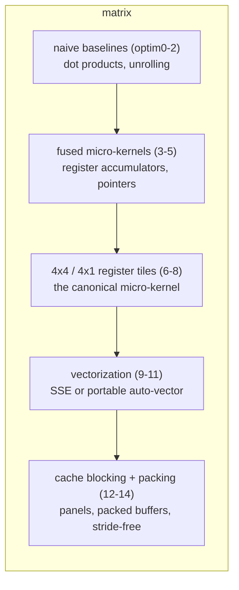

<!-- image placeholder — add your cover image path here -->


In any high-performance numerical workload — deep learning, scientific
simulation, finite-element solvers — two operations are at the core of the entire
stack:

1. **Matrix–Matrix multiplication** (GEMM)
2. **Matrix–Vector multiplication** (GEMV)

Matrix–matrix multiplication shows up everywhere — but it is the **matrix–vector**
product that dominates when you stream data through a layer at a time, and both are
the reason your programs are fast or slow.

---

## 1. Why GEMM dominates

Almost the entire field of dense linear algebra sits on two stones:

| Layer          | What it does                                                       |
| -------------- | ------------------------------------------------------------------ |
| **naive loops** | a triple `for` loop nobody should ship to production               |
| **BLAS kernels** | tuned `matmul` / `matvec` built over decades of cache and register tuning |

Every framework you actually use rides on the second layer:

- **LAPACK** is implemented in terms of BLAS level-1/2/3 routines.
- **OpenBLAS, GotoBLAS, BLIS** are exactly this — hand-tuned kernels plus a
  packing / blocking harness around them.
- **LLM inference** leans hard on matrix-vector per-token work.


So the question in front of us is: **how do we write kernels like OpenBLAS from
scratch?** This article is the story of that journey — turning a naive triple-loop
matrix multiply and matrix-vector multiply into cache-aware, vectorized
micro-kernels in plain C, following the classic FLAME *"How to Optimize GEMM"*
ladder, one step at a time.

---

## 2. What MATRIX is

**MATRIX** is our answer to that question: a hands-on, fully documented study of
how a naive triple loop becomes a near-peak kernel. It ships **30 self-contained,
runnable optimization levels** — 15 for `matmul`, 15 for `matvec` — plus the
complete mathematics behind every single one.

You get:

- **Two kernel families** — `C = A·B + C` and `y = A·x + y`, in BLAS-compatible
  column-major layout.
- **A visible ladder** — every level is an executable that times itself and prints
  GFLOPS, so you watch performance climb (or explain why it dips).
- **No black boxes** — C99, no external math libraries, no intrinsics required for
  the portable levels.
- **The math, in full** — one research note per level, with the FLOP and cache
  reasoning behind each step.


---

## 3. Who is this for?

| Audience | What you get |
| -------- | ------------ |
| **Students / learners** | A from-first-principles codebase: dot products, register tiling, SIMD, cache blocking, packing — plus a full tutorial walkthrough with the mathematics of every level |
| **Developers writing BLAS-like kernels** | A complete, runnable reference ladder to read, extend, and steal techniques from |
| **Performance / HPC engineers** | A working roofline lab: run the ladder, watch arithmetic intensity move you from memory-bound to compute-bound |

---

## 4. The journey — a curated tutorial list

To help you navigate building high-performance kernels with MATRIX, this series
covers the path we took, in dependency order:

| #  | Tutorial | Topic |
| -- | -------- | ----- |
| 00 | [https://ajeetkbhardwaj.github.io/matrix/tutorials/](https://ajeetkbhardwaj.github.io/matrix/tutorials/) | Overview of the ladder |
| 01 | [https://ajeetkbhardwaj.github.io/matrix/tutorials/01-build-and-run/](https://ajeetkbhardwaj.github.io/matrix/tutorials/01-build-and-run/) | Build & run the ladder |
| 02 | [https://ajeetkbhardwaj.github.io/matrix/tutorials/02-gflops-and-roofline/](https://ajeetkbhardwaj.github.io/matrix/tutorials/02-gflops-and-roofline/) | Reading GFLOPS & the roofline |
| 03 | [https://ajeetkbhardwaj.github.io/matrix/tutorials/03-matmul-from-naive-to-kernel/](https://ajeetkbhardwaj.github.io/matrix/tutorials/03-matmul-from-naive-to-kernel/) | matmul: naive → micro-kernel |
| 04 | [https://ajeetkbhardwaj.github.io/matrix/tutorials/04-matmul-blocking-and-packing/](https://ajeetkbhardwaj.github.io/matrix/tutorials/04-matmul-blocking-and-packing/) | matmul: blocking & packing |
| 05 | [https://ajeetkbhardwaj.github.io/matrix/tutorials/05-matvec-four-output-kernel/](https://ajeetkbhardwaj.github.io/matrix/tutorials/05-matvec-four-output-kernel/) | matvec: the 4-output kernel |
| 06 | [https://ajeetkbhardwaj.github.io/matrix/tutorials/06-writing-a-new-level/](https://ajeetkbhardwaj.github.io/matrix/tutorials/06-writing-a-new-level/) | Writing `optim15` yourself |

The complete mathematics lives in 30 research notes — one per level — for which
the maps below link straight to the source-grade math.

### matmul: `C = A·B + C`

| Level | Research note | Core idea |
| ----- | ------------- | --------- |
| optim0 | [naive triple loop](https://ajeetkbhardwaj.github.io/matrix/research/matmat/optim0/) | the memory-bound baseline, ~1 GFLOPS |
| optim1 | [AddDot extraction](https://ajeetkbhardwaj.github.io/matrix/research/matmat/optim1/) | factor the inner dot product |
| optim2 | [unrolling by 4](https://ajeetkbhardwaj.github.io/matrix/research/matmat/optim2/) | four columns at once, more ILP |
| optim3 | [fused `AddDot1x4`](https://ajeetkbhardwaj.github.io/matrix/research/matmat/optim3/) | one pass over `p`, reuse `A(i,p)` 4× |
| optim4 | [register accumulators](https://ajeetkbhardwaj.github.io/matrix/research/matmat/optim4/) | stop touching `C` inside the loop |
| optim5 | [pointer advancement](https://ajeetkbhardwaj.github.io/matrix/research/matmat/optim5/) | pointer arithmetic + 4× unroll |
| optim6 | [4×4 via AddDot](https://ajeetkbhardwaj.github.io/matrix/research/matmat/optim6/) | structural step — the square tile |
| optim7 | [fused 4×4 kernel](https://ajeetkbhardwaj.github.io/matrix/research/matmat/optim7/) | one loop, sixteen outputs, rank-1 update |
| optim8 | [register-tiled 4×4](https://ajeetkbhardwaj.github.io/matrix/research/matmat/optim8/) | the classic micro-kernel, 16 FMA chains |
| optim9 | [pointer-based A](https://ajeetkbhardwaj.github.io/matrix/research/matmat/optim9/) | drop the per-element `lda` multiply |
| optim10 | [statement reordering](https://ajeetkbhardwaj.github.io/matrix/research/matmat/optim10/) | better instruction scheduling for ILP |
| optim11 | [SSE vectorized 4×4](https://ajeetkbhardwaj.github.io/matrix/research/matmat/optim11/) | 8 vector accumulators instead of 16 (x86) |
| optim12 | [cache blocking](https://ajeetkbhardwaj.github.io/matrix/research/matmat/optim12/) | `mc × kc` panels that fit in cache |
| optim13 | [packing A](https://ajeetkbhardwaj.github.io/matrix/research/matmat/optim13/) | contiguous `4×k` panels |
| optim14 | [full packing + pointers](https://ajeetkbhardwaj.github.io/matrix/research/matmat/optim14/) | pack A **and** B, stride-free hot loop |

### matvec: `y = A·x + y`

| Level | Research note | Core idea |
| ----- | ------------- | --------- |
| optim0 | [naive matvec](https://ajeetkbhardwaj.github.io/matrix/research/matvec/optim0/) | the raw baseline, memory-bound by construction |
| optim1 | [AddDot extraction](https://ajeetkbhardwaj.github.io/matrix/research/matvec/optim1/) | factor the inner dot product |
| optim2 | [4× reduction unroll](https://ajeetkbhardwaj.github.io/matrix/research/matvec/optim2/) | unroll `p`, single accumulator chain |
| optim3 | [fused `AddDot1x4`](https://ajeetkbhardwaj.github.io/matrix/research/matvec/optim3/) | **the big jump**: four outputs, broadcast `x` |
| optim4 | [register accumulators](https://ajeetkbhardwaj.github.io/matrix/research/matvec/optim4/) | four independent chains live in registers |
| optim5 | [pointer-advanced x](https://ajeetkbhardwaj.github.io/matrix/research/matvec/optim5/) | pointer x + 4× reduction unroll |
| optim6 | [`AddDot4x1` wrapper](https://ajeetkbhardwaj.github.io/matrix/research/matvec/optim6/) | the named 4-output routine |
| optim7 | [fused `AddDot4x1`](https://ajeetkbhardwaj.github.io/matrix/research/matvec/optim7/) | the fused 4×1 micro-kernel |
| optim8 | [register-bound `AddDot4x1`](https://ajeetkbhardwaj.github.io/matrix/research/matvec/optim8/) | accumulators held for the whole loop |
| optim9 | [pointer-based A](https://ajeetkbhardwaj.github.io/matrix/research/matvec/optim9/) | drop the `lda` multiply |
| optim10 | [statement reordering](https://ajeetkbhardwaj.github.io/matrix/research/matvec/optim10/) | reorder + (optional) OpenMP hooks |
| optim11 | [portable auto-vectorization](https://ajeetkbhardwaj.github.io/matrix/research/matvec/optim11/) | no intrinsics — NEON/SSE/AVX via compiler |
| optim12 | [cache blocking](https://ajeetkbhardwaj.github.io/matrix/research/matvec/optim12/) | `kc` reduction + `mc` row blocks |
| optim13 | [packing A](https://ajeetkbhardwaj.github.io/matrix/research/matvec/optim13/) | contiguous panels for streaming reads |
| optim14 | [fully packed pointer kernel](https://ajeetkbhardwaj.github.io/matrix/research/matvec/optim14/) | stride-free, packed `4×1` kernel |

Run the ladder and watch: matvec jumps at **optim3** (four independent chains),
matmul jumps at **optim8** (the register tile) and again at **optim12–14** (cache
blocking + packing).

---

## 5. Project links

| Resource | Where |
| -------- | ----- |
| Source code (GitHub) | https://github.com/ajeetkbhardwaj/matrix |
| Documentation site | https://ajeetkbhardwaj.github.io/matrix/ |

---

## 6. Quick start — from zero to GFLOPS in three commands

> Requires: a C99 (or later) compiler (`gcc`, `clang`, or MSVC) and `make`
> (optional — you can run `gcc` directly). No external math libraries.

```bash
git clone https://github.com/ajeetkbhardwaj/matrix && cd matrix
make                # builds all 25 portable levels + reference drivers
make test           # runs the numerical correctness suite
```

### Run a level

Every optimization level is its own executable; it allocates random data, times
the kernel, and prints seconds + GFLOPS:

```bash
./build/matvec5
# Optimization 5 : Dot product took 0.0001234 seconds GFLOPS : 6.48

./build/matmat8
```

Run the whole ladder and watch the numbers climb:

```bash
for i in $(seq 0 14); do ./build/matvec$i; done
for i in $(seq 0 10); do ./build/matmat$i; done
```

### The "reference" GFLOPS formula

```
GFLOPS = 2 · (number of multiply-adds) / time
```

- matmul: `2 · m · n · k`
- matvec: `2 · m · k`

---

## 7. Building & using it — four ways

### Build a single level directly with gcc/clang

```bash
# matrix-vector, level 5
gcc -O2 -I include -o build/matvec5 src/matvec/optim5.c

# matrix-matrix, level 8
gcc -O2 -I include -o build/matmat8 src/matmat/optim8.c
```

### Call the reference kernel from your own code

```c
#include <gemm.h>

/* C = A·B + C, all double, column-major */
matmul(m, n, k, a, lda, b, ldb, c, ldc);
```

```c
#include <matvec.h>

/* y = A·x + y, A is m×k column-major */
matvec(m, k, a, lda, x, y);
```

`A(i,j)` lives at `a[j*lda + i]` (Fortran / BLAS convention) throughout.

### Off-the-shelf examples

`examples/` has copy-paste-ready drivers for both kernels:

```bash
gcc -O2 -I include -o build/ex_matmul examples/matmul_driver.c src/matmul.c
gcc -O2 -I include -o build/ex_matvec  examples/matvec_driver.c  src/matvec.c
```

### Optionally faster: the x86 SSE levels

```bash
# needs your own sse_compat.h on the include path
make ssematmat
```

---

## 8. Under the hood



| Subsystem | One-liner |
| --------- | --------- |
| **kernels** | 30 standalone levels (`src/matmat/optim*.c`, `src/matvec/optim*.c`) — each with its own `main()` |
| **reference API** | `include/gemm.h` / `include/matvec.h` — library kernels to link into your own code |
| **tests** | `tests/correctness.c` validates `matmul()` against a naive triple loop, including cache-blocking boundaries and "fringe" sizes |
| **docs** | mkdocs site: 6 tutorials + 30 research notes (one per level, full math) |
| **build** | one `Makefile`, outputs to `build/`, targets: `make`, `make test`, `make ssematmat` |

Everything is hand-written C99 with no external dependencies — the micro-kernel
is exactly the shape modern BLAS libraries use in production.

---

## 9. Supported platforms

| Compiler | OS | Notes |
| -------- | -- | ----- |
| `gcc` | Linux / WSL / macOS | everything runs |
| `clang` | macOS / most Linux | everything runs |
| `cl` (MSVC) | Windows | matvec family + matmul `optim0–10` run |
| NEON / SSE / AVX | ARM / x86 | matvec auto-vectorizes portably, no intrinsics |

Portability notes:

- **matvec is fully portable** — `optim11` deliberately uses **no intrinsics** and
  lets any compiler auto-vectorize (NEON / SSE / AVX). The same source runs on
  macOS, Linux, and Windows.
- **matmat `optim11–14`** use x86 SSE intrinsics (needs a local `sse_compat.h`),
  so they are optional; the portable matmul *reference* (`src/matmul.c`) includes
  a scalar fallback for non-x86 targets.

---

## 10. Where to go next

1. **Follow the tutorials** — §4, in order, to build the kernels yourself.
2. **Read the research notes** — every level's mathematics is documented, so you
   can see *why* each step exists, not just what it does.
3. **Run it** — the three commands in §6 are all you need.
4. **Build** — write your own `optim15` (`make` + `make test` stay green); try a
   new packing routine, a `6×8`/`8×12` production tile, or a portable
   `sse_compat.h`.