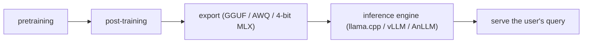
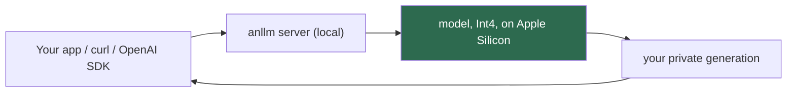
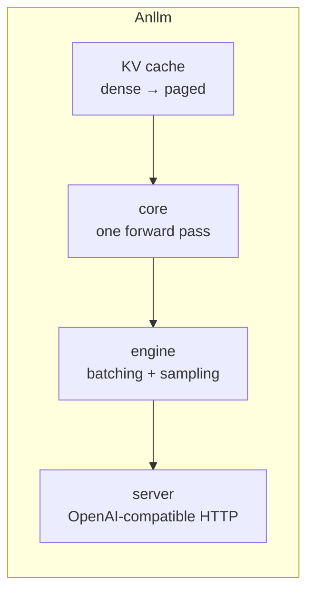

<!-- image placeholder — add your cover image path here -->


In any transformer-based large-scale model, especially LLMs, two operations are
at the core of the entire architecture:

1. **Matrix–Matrix multiplication**
2. **Matrix–Vector multiplication**

Matrix–matrix multiplication exists almost everywhere — but it is the
**matrix–vector** multiplication that we lean on at inference time to serve a
user's query.

---

## 1. The lifecycle of a large-scale model

The entire lifecycle of large-scale models can be divided into two parts:

1. **LLM Building**
2. **LLM Serving**

Most LLMs are based on the transformer architecture, so the *building* phase
subdivides further:

- **Pretraining** — we train the LLM on large-scale datasets (the entire
  internet over the history of time). The model becomes generalized enough for
  many tasks.
- **Post-training** — we align it with how humans actually do real tasks, via
  post-training on specific types of datasets and environments.

Then comes the real part: **how to save and export the model for inference**.
Many inference engines are built for specific devices:

- **llama.cpp** focuses on CPU / edge devices and accepts the **GGUF** model
  format.
- **vLLM, TensorRT**, and others are GPU-specialized and serve inference in
  distributed setups at large scale, requiring export formats like **AWQ**.

So the question in front of us is: **how do we build an inference engine like
llama.cpp or vLLM from scratch?** This article is the story of that journey —
building an LLM inference engine from first principles using **MLX** on Apple
Silicon.



---

## 2. What AnLLM is

**AnLLM** is our answer to that question: an inference engine for Apple Silicon
that runs LLMs privately on your own Mac, as 4-bit Int4 checkpoints, with an
OpenAI-compatible API — so any tool that speaks OpenAI's protocol just works
against your local machine.

You get:

- **Local, private inference** — models never leave your machine.
- **Small footprint** — a capable 4B model uses ~2.5 GB of unified memory.
- **Drop-in compatibility** — curl, the OpenAI Python SDK, and every tool that
  sends OpenAI requests work unchanged.
- **Built from first principles** — a clean, readable codebase with no black
  boxes.



---

## 3. Who is this for?

| Audience                                      | What you get                                                                                                                     |
| --------------------------------------------- | -------------------------------------------------------------------------------------------------------------------------------- |
| **Developers for Making Robust Engine** | An OpenAI-compatible local server + a small, understandable inference engine to read and extend                                  |
| **Students / learners**                 | A from-first-principles codebase: attention, RoPE, RMSNorm, KV cache, quantization, batching — plus a full tutorial walkthrough |

---

## 4. The journey — a curated tutorial list

To help you navigate building an LLM inference engine with MLX, this series
covers the path we took, in dependency order:

| #  | Tutorial                                                                                                                                                                                  | Topic                                  |
| -- | ----------------------------------------------------------------------------------------------------------------------------------------------------------------------------------------- | -------------------------------------- |
| 01 | [https://ajeetkbhardwaj.github.io/anllm/tutorials/01-foundations-mlx-and-metal/](https://ajeetkbhardwaj.github.io/anllm/tutorials/01-foundations-mlx-and-metal/)                           | MLX and Metal foundations              |
| 02 | [https://ajeetkbhardwaj.github.io/anllm/tutorials/02-linear-algebra-for-transformers/](https://ajeetkbhardwaj.github.io/anllm/tutorials/02-linear-algebra-for-transformers/)               | Linear algebra for transformers        |
| 03 | [https://ajeetkbhardwaj.github.io/anllm/tutorials/03-embeddings-and-tokenization/](https://ajeetkbhardwaj.github.io/anllm/tutorials/03-embeddings-and-tokenization/)                       | Embeddings and tokenization            |
| 04 | [https://ajeetkbhardwaj.github.io/anllm/tutorials/04-rmsnorm-normalization/](https://ajeetkbhardwaj.github.io/anllm/tutorials/04-rmsnorm-normalization/)                                   | RMSNorm normalization                  |
| 05 | [https://ajeetkbhardwaj.github.io/anllm/tutorials/05-rotary-position-embeddings/](https://ajeetkbhardwaj.github.io/anllm/tutorials/05-rotary-position-embeddings/)                         | Rotary position embeddings             |
| 06 | [https://ajeetkbhardwaj.github.io/anllm/tutorials/06-scaled-dot-product-attention/](https://ajeetkbhardwaj.github.io/anllm/tutorials/06-scaled-dot-product-attention/)                     | Scaled dot-product attention           |
| 07 | [https://ajeetkbhardwaj.github.io/anllm/tutorials/07-multi-head-and-grouped-query-attention/](https://ajeetkbhardwaj.github.io/anllm/tutorials/07-multi-head-and-grouped-query-attention/) | Multi-head and grouped-query attention |
| 08 | [https://ajeetkbhardwaj.github.io/anllm/tutorials/08-feed-forward-networks-and-silu-gating/](https://ajeetkbhardwaj.github.io/anllm/tutorials/08-feed-forward-networks-and-silu-gating/)   | Feed-forward networks and SiLU gating  |
| 09 | [https://ajeetkbhardwaj.github.io/anllm/tutorials/09-transformer-block-and-model-assembly/](https://ajeetkbhardwaj.github.io/anllm/tutorials/09-transformer-block-and-model-assembly/)     | Transformer block and model assembly   |
| 10 | [https://ajeetkbhardwaj.github.io/anllm/tutorials/10-quantization-4-bit-weights/](https://ajeetkbhardwaj.github.io/anllm/tutorials/10-quantization-4-bit-weights/)                         | Quantization: 4-bit weights            |
| 11 | [https://ajeetkbhardwaj.github.io/anllm/tutorials/11-mixture-of-experts/](https://ajeetkbhardwaj.github.io/anllm/tutorials/11-mixture-of-experts/)                                         | Mixture of experts                     |
| 12 | [https://ajeetkbhardwaj.github.io/anllm/tutorials/12-kv-cache-and-autoregressive-generation/](https://ajeetkbhardwaj.github.io/anllm/tutorials/12-kv-cache-and-autoregressive-generation/) | KV cache and autoregressive generation |
| 13 | [https://ajeetkbhardwaj.github.io/anllm/tutorials/13-paged-attention-and-memory-management/](https://ajeetkbhardwaj.github.io/anllm/tutorials/13-paged-attention-and-memory-management/)   | Paged attention and memory management  |
| 14 | [https://ajeetkbhardwaj.github.io/anllm/tutorials/14-sampling-strategies/](https://ajeetkbhardwaj.github.io/anllm/tutorials/14-sampling-strategies/)                                       | Sampling strategies                    |
| 15 | [https://ajeetkbhardwaj.github.io/anllm/tutorials/15-continuous-batching-and-scheduling/](https://ajeetkbhardwaj.github.io/anllm/tutorials/15-continuous-batching-and-scheduling/)         | Continuous batching and scheduling     |
| 16 | [https://ajeetkbhardwaj.github.io/anllm/tutorials/16-metal-kernels/](https://ajeetkbhardwaj.github.io/anllm/tutorials/16-metal-kernels/)                                                   | Metal kernels                          |
| 17 | [https://ajeetkbhardwaj.github.io/anllm/tutorials/17-openai-api-server/](https://ajeetkbhardwaj.github.io/anllm/tutorials/17-openai-api-server/)                                           | OpenAI API server                      |
| 18 | [https://ajeetkbhardwaj.github.io/anllm/tutorials/18-end-to-end/](https://ajeetkbhardwaj.github.io/anllm/tutorials/18-end-to-end/)                                                         | End-to-end                             |

The distilled architecture is also documented in a five-part series
(`articles/part-0..4-*.md` in the repo) and as a high-level map in
[`arch.md`](arch.md).

---

## 5. Project links

| Resource             | Where                                   |
| -------------------- | --------------------------------------- |
| Source code (GitHub) | https://github.com/ajeetkbhardwaj/anllm |
| Documentation site   | https://ajeetkbhardwaj.github.io/anllm/ |

---

## 6. Quick start — from zero to chatting in five commands

> Requires: a Mac with Apple Silicon, Python 3.10–3.12, a conda env (e.g.
> `conda activate aisystem`).

```bash
git clone https://github.com/ajeetkbhardwaj/anllm && cd anllm
pip install -r requirements.txt
pip install -e .
pip install huggingface_hub        # to download models from HuggingFace
```

### Step 1 — Download a model

```bash
huggingface-cli download mlx-community/Qwen3-4B-4bit   # ~2.5 GB, fits 16 GB
```

Models cache under `~/.cache/huggingface/hub/`.

### Step 2a — Chat right in the terminal

```bash
python -m anllm.cli run --model mlx-community/Qwen3-4B-4bit
```

Interactive REPL loops with you. For a one-shot response, pass the prompt as
the positional argument:

```bash
python -m anllm.cli run "Name three primary colors" --model mlx-community/Qwen3-4B-4bit
```

### Step 2b — Or switch any model family

```bash
python -m anllm.cli run "Hello" --model mlx-community/Llama-3.2-3B-Instruct-4bit
```

The engine dispatches on each checkpoint's `config.json` `model_type`, so
Qwen3 and Llama 3.x 4-bit checkpoints load with no code changes.

### Step 3 — Serve it as an API

```bash
python -m anllm.cli serve --model mlx-community/Qwen3-4B-4bit --host 127.0.0.1 --port 8402
```

That boots an **OpenAI-compatible** server:

| Endpoint                      | Purpose                                         |
| ----------------------------- | ----------------------------------------------- |
| `GET /healthz`              | liveness probe (`{"ok":true}`)                |
| `GET /v1/models`            | list loaded models                              |
| `POST /v1/chat/completions` | chat (streaming + non-streaming)                |
| `POST /v1/completions`      | raw text completion (streaming + non-streaming) |

---

## 7. Talking to it — three ways

### curl (streaming)

```bash
curl -N http://127.0.0.1:8402/v1/chat/completions \
  -H 'Content-Type: application/json' \
  -d '{"model":"mlx-community/Qwen3-4B-4bit",
       "messages":[{"role":"user","content":"Say hi in 4 words"}],
       "max_tokens":12, "stream":true}'
```

You'll see SSE `data:` chunks ending in `data: [DONE]`.

### OpenAI Python SDK (drop-in)

```python
from openai import OpenAI

client = OpenAI(base_url="http://127.0.0.1:8402/v1", api_key="not-needed")

resp = client.chat.completions.create(
    model="mlx-community/Qwen3-4B-4bit",
    messages=[{"role": "user", "content": "Name three primary colors."}],
    max_tokens=24,
)
print(resp.choices[0].message.content)
```

Streaming works identically (`stream=True`, iterate chunks).

### Any OpenAI-compatible tool

Because the wire format is OpenAI's, tools like LangChain, Open WebUI, or
custom automation can point their `base_url` at your local server and work
unchanged.

---

## 8. Under the hood



| Subsystem        | One-liner                                                                         |
| ---------------- | --------------------------------------------------------------------------------- |
| **cache**  | Stores each token's K/V so nothing is recomputed; a paged pool keeps memory tight |
| **core**   | `ForCausalLM` — one shared Int4 forward pass for Qwen3/Llama/Mistral           |
| **engine** | Continuous batching: many concurrent chats share one batched decode               |
| **server** | FastAPI app with SSE streaming, safe single-threaded MLX execution                |

Everything is implemented from first principles on **MLX** (Apple's ML
framework), with (Optinal/Avoided for Now)hand-written **Metal kernels** as an optional accelerator —
and a pure-Python path that always works even without the kernels.

---

## 9. Supported models

| Family                  | Sizes                | Example HuggingFace ID                       |
| ----------------------- | -------------------- | -------------------------------------------- |
| Qwen3 (dense)           | 0.6B–8B             | `mlx-community/Qwen3-4B-4bit`              |
| Llama 3.2 / 3.1 (dense) | 1B–8B               | `mlx-community/Llama-3.2-3B-Instruct-4bit` |
| Mistral                 | similar dense builds | via`model_type` dispatch                   |

Larger dense models (14B+) and MoE/multimodal builds (Llama 4, Gemma 4-E2B)
are intentionally out of scope for a 16 GB-first engine.

---

## 10. Where to go next

1. **Follow the tutorials** — §4, in order, to build it yourself.
2. **Read the architecture series** — `articles/part-0-first-principles.md`
   through `part-4-server.md` explains *why each piece exists*, with math and
   diagrams.
3. **Run it** — the five commands in §6 are all you need.
4. **Build** — try a different model family or a longer context; the design deliberately makes new architectures a config-time change, not a code change.


