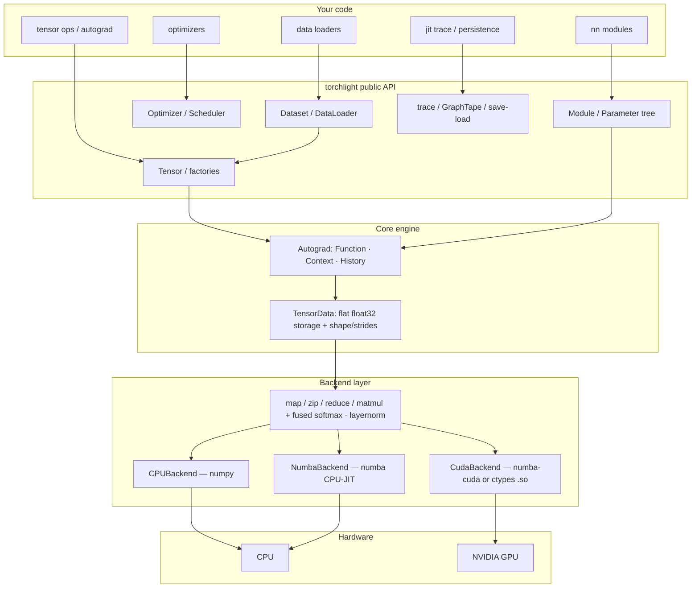

The best way to understand deep learning is to build it. Not a wrapper around
TensorFlow, not a thin PyTorch clone — a real framework, where you can read
*every line* that makes backpropagation, GPU kernels and a language model work.

That is what **torchlight** is: a lightweight, from-scratch deep learning
framework, CPU-first, numpy-backed, with an optional numba-CUDA accelerator —
and with three real end-to-end projects (sentiment analysis, English→French
translation, and a miniature GPT on Shakespeare) shipped on top of it.

> **Repository:** https://github.com/ajeetkbhardwaj/torchlight
> **Documentation:** https://ajeetkbhardwaj.github.io/torchlight/

---

## Why build a framework from scratch?

Every serious AI engineer eventually hits the point where a framework feels
like a black box. Gradients appear "magically"; a `nn.Module` does things you
don't fully trust; `loss.backward()` might as well be a prayer.

Torchlight was built to replace that feeling with certainty. Its design goals
are deliberately modest:

- **A tiny surface area.** The entire compute layer is four primitives
  (`map`, `zip`, `reduce`, `matmul`) plus a couple of fused kernels. If you
  understand those, you understand the whole engine.
- **Numerical correctness you can assert.** Every operation ships with a
  finite-difference gradcheck in the test suite — the math isn't "trusted", it
  is *proven*.
- **CPU-first and dependency-light.** A single hard dependency: numpy. No
  compiled extensions, no GPU required to get started.
- **Small-scale LLM experiments.** Big enough to train a real sequence model,
  small enough to read overnight.

---

## The core bet: tensors all the way down

Torchlight is a study in reduction. High-level concepts — layers, losses,
optimizers, datasets — are all bookkeeping on top of one object: the `Tensor`.

The whole system, in one diagram:



The layers, bottom-up:

### 1. Tensors and `TensorData`

A tensor's real data lives in a `TensorData`: a *flat* one-dimensional
`float32` buffer, plus shape and strides. Views, transposes and broadcasts
change strides — never the buffer. That one decision makes `x.T @ y`,
slicing, and broadcasting all zero-copy and boringly fast.

```python
import torchlight as tl

x = tl.tensor([[1.0, 2.0], [3.0, 4.0]], requires_grad=True)
t = x.T          # strided view, no copy
m = x @ t        # matmul through the backend
```

### 2. The autograd engine

Reverse-mode automatic differentiation over a **dynamic** graph. Each forward
op is a `Function` that records a `History` node on its output: the function,
the saved inputs, and a `Context` for forward-pass values. `backward()` then
walks the graph in reverse topological order:

```python
y = (x ** 2).sum()
y.backward()
print(x.grad.to_numpy())   # [2.0, 4.0, 6.0]
```

The whole engine — `Function`, `Context`, `History`, the topo-sort and
backpropagation — lives in a few hundred readable lines under
`src/torchlight/autograd/`.

### 3. Modules, parameters, optimizers

`nn.Module` intercepts attribute assignment. A `Parameter` lands in
`_parameters`; a child `Module` in `_modules`. `parameters()` walks the tree
recursively, so Adam and the checkpoint saver see every trainable tensor with
zero extra registration. On top of that: `Linear`, `Embedding`, `Conv1d/2d`,
LayerNorm/BatchNorm, dropout, activations, pooling, losses, plus SGD
(momentum/nesterov), Adam, and AdamW.

```python
from torchlight.nn import Sequential, Linear, ReLU
from torchlight.optim import Adam

model = Sequential(Linear(2, 16), ReLU(), Linear(16, 2))
opt = Adam(model.parameters(), lr=1e-3)
```

### 4. The six-primitive backend layer

All compute funnels through **map / zip / reduce / matmul** (+ fused
softmax/LayerNorm). That contract is small enough to be reimplemented three
times — numpy on CPU, numba JIT, numba-CUDA on an NVIDIA GPU — so device
parity is guaranteed by construction. `TORCHLIGHT_DEVICE=cuda` flips the
switch; a missing driver produces a clear error instead of a silent fallback.

### 5. Data, tracing, persistence

- `Dataset` / `TensorDataset` / `DataLoader` with shuffling and batching,
  plus a synthetic-problem zoo (`Xor`, `Circle`, `Spiral`, ...) for smoke
  tests.
- `jit.trace` records a forward pass as an *op tape*, then `count_ops()` or
  replays it on new inputs without rebuilding the autograd graph.
- `save_state`/`load_state` persist any model to a `.npz` checkpoint.

---

## Proof it works: real projects on real data

A framework is only as good as what you can build with it. Torchlight ships
three complete projects, each documented **from first principles**, maths
included:

**1. Sentiment classifier** — 3000 real IMDb/Amazon/Yelp reviews through an
embedding → masked-mean pooling → MLP, trained end to end.
*Article:* https://ajeetkbhardwaj.github.io/torchlight/projects/sentiment-classifier/

**2. English → French translation** — a GRU encoder-decoder with Luong
attention, teacher forcing, and greedy decoding on ~102k real Tatoeba pairs.
This one taught me something a library would have hidden: the *off-by-one in
targets*. Decoder input starts with `SOS`; the training target must end with
`EOS`. Get that wrong and the model happily predicts padding forever.

**3. A miniature GPT** — a real decoder-only transformer (causal self-attention,
multi-head, LayerNorm + residuals) trained character-by-character on tiny
Shakespeare, complete with temperature sampling. Every attention head is
hand-built from `Q`, `K`, `V` — no `Attention` module exists to lean on.

Each project runs as `train.py` → saves `out/*.npz` → `post.py` reloads,
evaluates (accuracy/F1, BLEU, perplexity) and plots. The full loop of a
research project, end to end, in one directory.

**The sklearn examples** show the same framework dropping into classic ML —
an MLP with BatchNorm/Dropout/cosine annealing on breast cancer, a CNN on
handwritten digits, and a class-conditioned autoencoder.
*Article:* https://ajeetkbhardwaj.github.io/torchlight/examples/sklearn-classifier/

**Start with the tensor tutorial** to see exactly what the codebase does:
https://ajeetkbhardwaj.github.io/torchlight/tutorials/01-tensors/

---

## Quality you can run

A from-scratch framework that can't be trusted is a liability. Torchlight
addresses that with:

- **260 passing tests**, including finite-difference gradchecks on every op,
- CPU/numba/CUDA op parity locked by tests,
- a full **CI suite on GitHub Actions** (Python 3.10–3.12) and **CD** that
  builds the docs and deploys them to GitHub Pages on every push to `main`,
- sedate numeric stability: softmax, log-softmax and cross-entropy are written
  to survive hostile input (e.g. `exp(x - max(x))`).

## Articles, docs, and where all the maths lives

The documentation is the heart of the project. Every page explains the model
*from first principles*, with the maths rendered on the page:

- **System design** (this entire architecture, with diagrams) — the docs home,
- a **tutorial series** (tensors → autograd → nn → data/optimizers → backends →
  jit/persistence → real datasets),
- **one page per project** and **one per example**, each deriving its formulas
  ($\sigma(z)=\frac{1}{1+e^{-z}}$, attention scores, GRU gates, ...) and then
  mapping them onto the code.

Exactly the kind of article you are reading is what got me from "that seems
intimidating" to "I can build this."

---

## What's next

- more fused kernels and tighter parity between the numpy and CUDA paths,
- higher-capacity experiments (a slightly larger GPT, maybe a byte-pair tokenizer),
- publishing the package to PyPI once the name situation is settled.

## Links

- Source: https://github.com/ajeetkbhardwaj/torchlight
- Docs: https://ajeetkbhardwaj.github.io/torchlight/
- Tutorial 1 — Tensors: https://ajeetkbhardwaj.github.io/torchlight/tutorials/01-tensors/
- Project — Sentiment classifier: https://ajeetkbhardwaj.github.io/torchlight/projects/sentiment-classifier/
- Example — sklearn classifier: https://ajeetkbhardwaj.github.io/torchlight/examples/sklearn-classifier/
