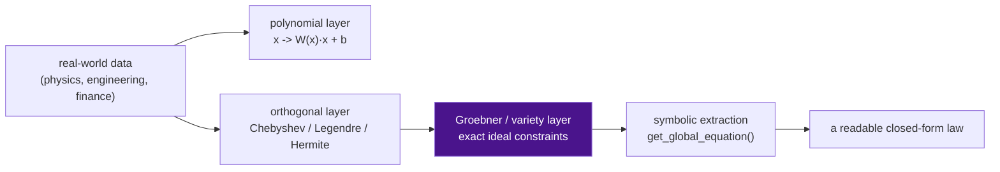
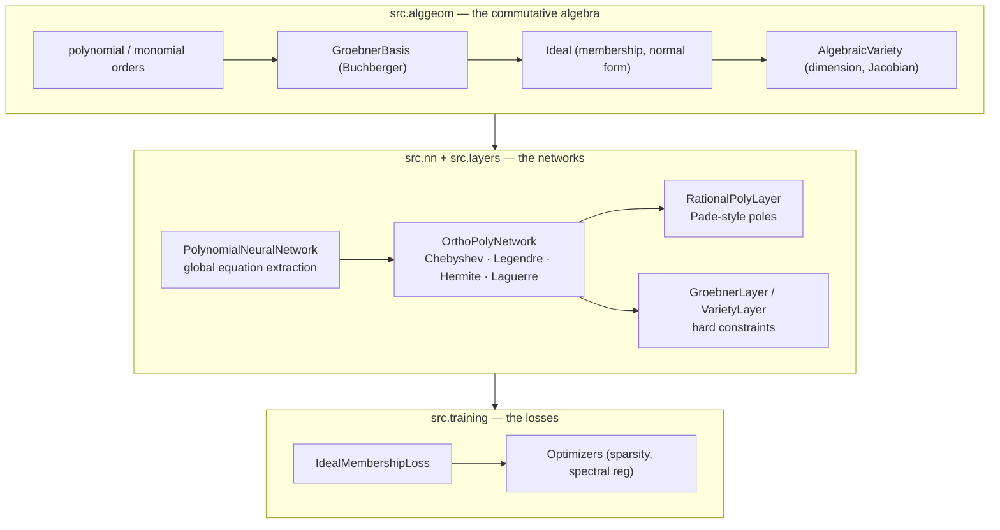

In standard neural networks, every hidden layer applies the same two operations:

1. An **affine map** $x \mapsto Wx + b$
2. A **nonlinear activation** (ReLU, tanh, sigmoid)

Both are chosen for optimization convenience, not for structure. The weights are
opaque tensors — you train them, you use them, and you can't say what the network
*means* in any mathematical sense. The polynomial neural network asks a different
question: what if the network itself were built out of the machinery of
**commutative algebra** — so that its weights are elements of a coordinate ring,
its hypothesis space is an algebraic variety, and its learned function comes out
as a **closed-form equation you can read**?

That is what **AGL** sets out to build.

---

## 1. The idea in one sentence

Treat the network's weights as **polynomials** over the coordinate ring
$\mathbb{R}[x_1, \dots, x_n]$, then let the a system of algebraic constraints —
Gröbner bases, ideals, varieties — do the heavy lifting during training.

Because polynomials are closed under composition, any multi-layer polynomial
network collapses to one single high-degree polynomial map from inputs to
outputs. And that function isn't hidden inside the tensor stack anymore: AGL can
**expand it out into a symbolic equation** at the end of training.

---

## 2. What AGL is

**AGL** is a PyTorch library that physically embeds algebraic geometry into
polynomial neural networks. Instead of "fit a curve", you ask the network to
learn a function *inside a constrained algebraic structure* — and it hands the
structure back to you as arithmetic.

You get:

- **Exact symbolic extraction** — the global map of the network printed as an
  equation (e.g. rediscover Kepler's $T^2 \propto a^3$ as `-0.667 + 1.5·log_a`).
- **Hard constraints, not soft penalties** — Gröbner layers reduce weights
  modulo a constraint ideal to machine precision; the constraint becomes a
  property of the architecture, not of the optimizer.
- **Stability at high degree** — orthogonal bases (Chebyshev, Legendre, Hermite,
  Laguerre) keep the condition number orders of magnitude below the monomial
  basis, so degree-10+ network still train without divergence.
- **Physics-grade interpretability** — on the chaotic Lorenz system, an
  OrthoPolyNN both *outperforms* a deep ReLU MLP at 1000-step rollout *and*
  returns `dz/dt ≈ 0.0099·xy − 0.0145·x + 0.0087·y + 0.9737·z − 0.0081`.



---

## 3. Who is this for?

| Audience | What you get |
| ------------------------------------------ | ---------------------------------------------------------------------------------- |
| **Researchers in ML / geometric learning** | A working substrate for neurovariety studies, ideal-constrained training, and stable high-degree polynomial NNs |
| **Symbolic regression and physics discovery** | A network that trains like a NN but **returns an equation** — verifiable, compilable, exact |
| **Students of algebra–ML intersections** | Definitions-to-code documentation: monomial orders → Gröbner bases → ideals → varieties, each built from scratch |

---

## 4. The journey — documentation and tutorials

The docs develop the mathematics in dependency order, from definitions to
working code, then apply the library to six real datasets:

| # | Resource | Topic |
| -- | ------------------------------------------------------------------------------------------ | ------------------------------------------- |
| 01 | [Algebraic Geometry — Part I](https://ajeetkbhardwaj.github.io/agl/Algebraic%20Geometry%20-%20Part-I/) | Polynomials, monomial orders, Gröbner bases |
| 02 | [Algebraic Geometry — Part II](https://ajeetkbhardwaj.github.io/agl/Algebraic%20Geometry%20-%20Part-II/) | Ideals, varieties, the Jacobian criterion |
| 03 | [Algebraic Geometry — Part III](https://ajeetkbhardwaj.github.io/agl/Algebraic%20Geometry%20-%20Part-III/) | System solving and computational geometry |
| 04 | [Neural Networks — Part I](https://ajeetkbhardwaj.github.io/agl/Neural%20Networks%20-%20Part-I/) | The polynomial layer and the "Everything Equation" |
| 05 | [Neural Networks — Part II](https://ajeetkbhardwaj.github.io/agl/Neural%20Networks%20-%20Part-II/) | Orthogonal polynomial layers (adaptive normalization) |
| 06 | [Neural Networks — Part III](https://ajeetkbhardwaj.github.io/agl/Neural%20Networks%20-%20Part-III/) | Rational polynomial layers and localized poles |
| 07 | [Tutorial 1 — Kepler's Third Law](https://ajeetkbhardwaj.github.io/agl/Tutorial%201%20-%20Keplers%20Third%20Law/) | Discover `T² ∝ a³` from NASA exoplanet data |
| 08 | [Tutorial 2 — Mauna Loa CO₂](https://ajeetkbhardwaj.github.io/agl/Tutorial%202%20-%20Mauna%20Loa%20CO2/) | Chebyshev trend + seasonal structure, extrapolation limits |
| 09 | [Tutorial 3 — Sunspot Cycles](https://ajeetkbhardwaj.github.io/agl/Tutorial%203%20-%20Sunspot%20Forecasting/) | Hermite vs Chebyshev on spiky unbounded AR |
| 10 | [Tutorial 4 — Concrete Strength](https://ajeetkbhardwaj.github.io/agl/Tutorial%204%20-%20Concrete%20Strength/) | Extract a readable mix-design formula (8 ingredients → MPa) |
| 11 | [Tutorial 5 — Power Plant Output](https://ajeetkbhardwaj.github.io/agl/Tutorial%205%20-%20Power%20Plant%20Output/) | Additive vs multiplicative (Segre) at 9.5k samples |
| 12 | [Tutorial 6 — Airfoil Noise](https://ajeetkbhardwaj.github.io/agl/Tutorial%206%20-%20Airfoil%20Noise/) | Extract a scaling law, then Gröbner-enforce an aerodynamic relation |

---

## 5. Project links

| Resource | Where |
| --------- | ------------------------------------------- |
| Source code (GitHub) | https://github.com/ajeetkbhardwaj/agl |
| Documentation site | https://ajeetkbhardwaj.github.io/agl/ |

---

## 6. Quick start — from zero to a closed-form equation

> Requires: Python 3.10+, PyTorch, and the usual scientific stack.
> Works with a conda env (e.g. `conda activate aisystem`).

```bash
git clone https://github.com/ajeetkbhardwaj/agl && cd agl
pip install -r requirements.txt
pytest            # run the test suite
```

### Step 1 — Symbolic regression / law discovery

```bash
python examples/symbolic_regression.py
```

Fits a monomial-basis PNN to a known cubic and prints the recovered polynomial —
e.g. `3.269x³ − 1.722x² + 2.097x − 0.929` against the true
`3.5x³ − 1.5x² + 2x − 1`.

### Step 2 — Exact coefficient extraction

```bash
python examples/equation_extraction.py
```

Recovers Chebyshev coefficients **exactly** to printed precision.

### Step 3 — Chaotic dynamics (the fun one)

```bash
python examples/lorenz_attractor.py
```

Trains a degree-1 multilinear OrthoPolyNN on the Lorenz map and a deep ReLU MLP,
rolls both forward 1000 steps, and prints the extracted equations alongside the
mean trajectory error:

| Model | Mean trajectory error (lower is better) |
| ----- | --------------------------------------- |
| **OrthoPolyNN (PyTorch)** | **11.79** |
| OrthoPolyNN (compiled SymPy) | 11.85 |
| Standard MLP (ReLU) | 19.95 |

A symbolic Lorenz system, recovered from data, that *beats* the black-box MLP at
long-horizon extrapolation.

### Step 4 — More real-data examples

```bash
python examples/california_housing.py   # OrthoPolyNN R² 0.769 vs MLP 0.739
python examples/solve_ode.py            # solve an ODE with polynomial layers
```

---

## 7. Under the hood



| Subsystem | One-liner |
| ------------- | --------------------------------------------------------------- |
| **alggeom** | Polynomials, monomial orders, Gröbner bases (Buchberger), ideals, varieties, system solving |
| **layers** | `PolynomialLayer`, `OrthoPolyLayer` (additive + multiplicative Segre), `RationalPolyLayer`, `GroebnerLayer`, `VarietyLayer` |
| **nn** | `PolynomialNeuralNetwork` with exact symbolic distillation, `OrthoPolyNetwork` |
| **training** | Ideal-membership and variety-constraint losses, polynomial-aware optimizers, spectral regularization |
| **utils** | Symbolic utilities and visualization |

Everything is PyTorch-native and autograd-compatible; the symbolic side (SymPy)
is called only at extraction time, so training stays fast and the exact equation
comes out at the end.

---

## 8. What the experiments actually show

We were careful to report results as they are, not as a marketing story.

- **Where AGL wins clearly** — chaotic dynamics (Lorenz rollout, ~40% lower error
  than a deep ReLU MLP **plus** closed-form equations), exact constraint
  enforcement (Gröbner layer satisfies the constraint to ~1e-7, a soft penalty
  cannot), and stability at degree ≥ 10 where the monomial basis diverges.
- **Where AGL is competitive** — tabular regression on Airfoil (R² 0.953 vs 0.887)
  and Power Plant; exact recovery on symbolically structured problems.
- **Where AGL loses, honestly** — Concrete and California Housing (MLP still
  wins), and it trains **slower** than a plain MLP (the algebraic bookkeeping has
  a real cost). Scalability of the algebraic layers is open work.

The takeaway, stated plainly: use AGL where the problem has polynomial or
constraint-bearing structure — it pays off there. For generic tabular regression
it is not a drop-in replacement for an MLP.

---

## 9. Where to go next

1. **Read the theory** — the Algebraic Geometry and Neural Networks parts (§4)
   build everything from definitions to code.
2. **Run the tutorials** — each of the six real-data tutorials ships a runnable
   script under `experiments/`.
3. **Try the chaos example** — `examples/lorenz_attractor.py` is the best single
   demonstration of what algebraic structure buys you.
4. **Contribute** — the most valuable direction is making the Groebner/variety
   layers faster; the framework's correctness is there, scalability is the gap.