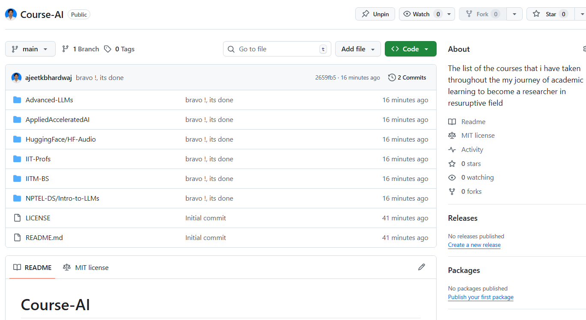

Course-AI is the collection of some of the best resources that defines the my Academic Journey to become AI Industry ready Professional. I have put the source code and the short notebook that i have taken during this journey so that other can look into it that might help students to not only learn theory but also practice them such that they might applicable to the industry as well.
## Table of Contents

