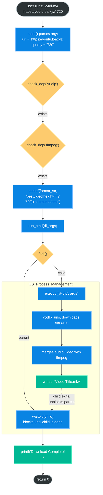

> **No Python. No Node. No shell scripts.** Just C, `fork()`, and `execvp()` calling `yt-dlp` at full speed.


Downloading YouTube videos from the command line usually means writing a shell script or reaching for Python. This project takes a different approach: a **native C binary** that orchestrates `yt-dlp` and optionally `aria2c` for parallel, multi-fragment downloads — built with a self-contained C build system.

---

## Table of Contents

1. [What This Project Does](#1-what-this-project-does)
2. [Project Structure](#2-project-structure)
3. [The Runtime Header: `nobuild.h`](#3-the-runtime-header-nobuildh)
   - [System Includes &amp; Compiler Config](#31-system-includes--compiler-config)
   - [`run_cmd()` — Process Execution Engine](#32-run_cmd--process-execution-engine)
   - [`check_dep()` — Dependency Detection](#33-check_dep--dependency-detection)
4. [The Downloader: `ytdl_m4.c`](#4-the-downloader-ytdl_m4c)
   - [Argument Parsing &amp; Usage](#41-argument-parsing--usage)
   - [Dependency Gating](#42-dependency-gating)
   - [Format String Construction](#43-format-string-construction)
   - [Assembling the `yt-dlp` Argument Array](#44-assembling-the-yt-dlp-argument-array)
5. [The Turbo Build Driver: `build.c`](#5-the-turbo-build-driver-buildc)
   - [Optional `aria2c` Acceleration](#51-optional-aria2c-acceleration)
   - [Dynamic Argument List Pattern](#52-dynamic-argument-list-pattern)
   - [Concurrent Fragments](#53-concurrent-fragments)
6. [The `yt-dlp` Format Selector Explained](#6-the-yt-dlp-format-selector-explained)
7. [How It All Works End-to-End](#7-how-it-all-works-end-to-end)
8. [Building &amp; Running](#8-building--running)
9. [Usage Examples](#9-usage-examples)
10. [Extending the Tool](#10-extending-the-tool)

---

## 1. What This Project Does

This is a **native macOS C CLI tool** that wraps `yt-dlp` with a clean interface for quality selection and high-speed downloading. It comes in two modes:

| Binary      | Description                                                                     |
| ----------- | ------------------------------------------------------------------------------- |
| `ytdl-m4` | Standard downloader — best video + audio merged into `.mkv`                  |
| `build`   | Turbo downloader — same, but adds `aria2c` parallel downloading if available |

**Key capabilities:**

- ✅ Quality selection: `480`, `720`, `1080`, `1440`, `2160`
- ✅ Automatic video + audio merging into `.mkv` via `ffmpeg`
- ✅ Playlist support — downloads entire playlists into organized folders
- ✅ Parallel fragment downloading (`--concurrent-fragments 16`)
- ✅ Optional `aria2c` acceleration (`-x 16 -s 16` — 16 connections per file)
- ✅ Zero runtime dependencies beyond `yt-dlp` and `ffmpeg`
- ✅ Built entirely in C — no Python, no shell, no interpreter overhead

---

## 2. Project Structure

```
ytube-dowloader/
├── nobuild.h       ← Shared runtime: run_cmd(), check_dep()
├── ytdl_m4.c       ← Standard downloader (simple, clean)
├── build.c         ← Turbo downloader (aria2c, parallel frags)
├── ytdl-m4         ← Compiled binary of ytdl_m4.c
└── build           ← Compiled binary of build.c
```

There are **two separate programs** sharing the same `nobuild.h` header:

- `ytdl_m4.c` → compiled to `ytdl-m4` — the basic, stable downloader
- `build.c` → compiled to `build` — the advanced, turbo variant with `aria2c` support

---

## 3. The Runtime Header: `nobuild.h`

`nobuild.h` is a **single-header library** providing the two primitives everything else depends on.

### 3.1 System Includes & Compiler Config

```c
#ifndef NOBUILD_H
#define NOBUILD_H

#include <stdio.h>
#include <stdlib.h>
#include <string.h>
#include <sys/wait.h>   // waitpid()
#include <unistd.h>     // fork(), execvp()
#include <sys/stat.h>   // stat() — file metadata

#define COMPILER "clang"
#define CFLAGS   "-O3", "-Wall", "-target", "arm64-apple-macos"
```

- `<sys/wait.h>` — needed for `waitpid()`, which blocks until a child process exits.
- `<unistd.h>` — provides `fork()` and `execvp()`, the two POSIX primitives for spawning processes.
- `<sys/stat.h>` — included for potential future use (mtime-based rebuild detection, as used in the `how-to-build-system-in-c` sister project).
- `CFLAGS` targets `arm64-apple-macos` explicitly — optimized for Apple Silicon (M1/M2/M3/M4).

---

### 3.2 `run_cmd()` — Process Execution Engine

This is the core of the entire project. Every external tool (`yt-dlp`, `ffmpeg`) is launched through this function:

```c
void run_cmd(char **args) {
    pid_t pid = fork();
    if (pid == 0) {
        execvp(args[0], args);
        perror("execvp");
        exit(1);
    }
    waitpid(pid, NULL, 0);
}
```

**How it works, step by step:**

1. **`fork()`** — duplicates the current process. The OS uses copy-on-write pages, so this is nearly free.
2. **`if (pid == 0)`** — this branch runs only in the **child process** (fork returns 0 to the child, the actual PID to the parent).
3. **`execvp(args[0], args)`** — replaces the child process's memory image with `yt-dlp`. The child ceases to be a C program; it becomes `yt-dlp`. `execvp` searches `PATH` for the binary automatically.
4. **`perror("execvp")`** — if `execvp` returns at all, it failed (e.g., binary not found). We print the OS error and exit.
5. **`waitpid(pid, NULL, 0)`** — the parent blocks here until `yt-dlp` finishes. The download runs synchronously from the user's perspective.

**Why not just use `system("yt-dlp ...")`?**

| `system("yt-dlp ...")`            | `execvp(args[0], args)`     |
| ----------------------------------- | ----------------------------- |
| Spawns `/bin/sh -c "..."` first   | Directly execs the binary     |
| Requires string escaping for URLs   | Array of args — no escaping  |
| Shell injection risk with user URLs | No shell involved, fully safe |
| One extra process overhead          | Zero overhead                 |

A YouTube URL containing `&`, `?`, `=`, or shell metacharacters would need careful quoting with `system()`. With `execvp()` and a `char **args` array, each argument is passed verbatim — no quoting, no injection risk.

---

### 3.3 `check_dep()` — Dependency Detection

```c
int check_dep(const char *tool) {
    char cmd[256];
    sprintf(cmd, "command -v %s > /dev/null 2>&1", tool);
    return system(cmd) == 0;
}
```

`command -v <tool>` is a POSIX shell built-in that exits `0` if the tool exists in `PATH`, non-zero otherwise. By redirecting both stdout (`> /dev/null`) and stderr (`2>&1`) to `/dev/null`, we suppress all output — we only care about the exit code.

`system()` returns the exit status of the shell command. If it's `0`, the tool exists. This allows the program to:

- **Hard-fail** if `yt-dlp` is missing (cannot download anything)
- **Soft-degrade** if `aria2c` is missing (fall back to standard mode)

---

## 4. The Downloader: `ytdl_m4.c`

The standard, clean downloader. Fewer options, maximum clarity.

### 4.1 Argument Parsing & Usage

```c
void print_usage(char *prog) {
    printf("Usage: %s <URL> [quality]\n", prog);
    printf("Qualities: 480, 720, 1080, 1440, 2160 (default: 1080)\n");
}

int main(int argc, char **argv) {
    if (argc < 2) {
        print_usage(argv[0]);
        return 1;
    }

    const char *url     = argv[1];
    const char *quality = (argc == 3) ? argv[2] : "1080";
```

- `argv[0]` — the program name itself (e.g., `./ytdl-m4`)
- `argv[1]` — the YouTube URL (required)
- `argv[2]` — optional quality string, defaults to `"1080"` via the ternary

The ternary `(argc == 3) ? argv[2] : "1080"` is idiomatic C for optional arguments with defaults. No flag parsing needed — positional arguments keep the interface simple.

---

### 4.2 Dependency Gating

```c
if (!check_dep("yt-dlp") || !check_dep("ffmpeg")) {
    printf("[ERROR] Please install dependencies: brew install yt-dlp ffmpeg\n");
    return 1;
}
```

Both `yt-dlp` and `ffmpeg` are required for `ytdl_m4.c`:

- **`yt-dlp`** — downloads the video and audio streams
- **`ffmpeg`** — merges them into the `.mkv` container (invoked automatically by `yt-dlp` via `--merge-output-format`)

If either is missing, we exit immediately with a helpful install command. This is a **fail-fast** pattern — better to abort clearly than to fail deep inside `execvp` with a cryptic error.

---

### 4.3 Format String Construction

```c
char format_str[256];
sprintf(format_str, "bestvideo[height<=?%s]+bestaudio/best", quality);
```

This builds the `yt-dlp` format selector string dynamically. For `quality = "720"`, it produces:

```
bestvideo[height<=?720]+bestaudio/best
```

This is `yt-dlp`'s **format selection syntax**:

| Part                        | Meaning                                                                     |
| --------------------------- | --------------------------------------------------------------------------- |
| `bestvideo[height<=?720]` | Best quality video stream with height ≤ 720px                              |
| `+bestaudio`              | Merge with the best available audio stream                                  |
| `/best`                   | Fallback: if separate streams aren't available, take the best single stream |

The `<=?` operator is `yt-dlp`-specific: the `?` makes it a **soft constraint** — if no stream at exactly that height exists, it picks the closest available one rather than failing.

---

### 4.4 Assembling the `yt-dlp` Argument Array

```c
char *dl_args[] = {
    "yt-dlp",
    "-f", format_str,                    // Format selector
    "--merge-output-format", "mkv",      // Output container
    "--yes-playlist",                    // Auto-handle playlists
    "-o", "%(title)s.%(ext)s",          // Output filename template
    (char*)url,                          // The URL
    NULL                                 // execvp sentinel
};

run_cmd(dl_args);
```

Every element is a separate string — this maps exactly to what `argv` looks like inside `yt-dlp`. The `NULL` terminator is required by `execvp`: it signals the end of the argument list.

**`yt-dlp` flags used:**

| Flag                          | Effect                                   |
| ----------------------------- | ---------------------------------------- |
| `-f <format>`               | Format selector string                   |
| `--merge-output-format mkv` | Mux video+audio into Matroska container  |
| `--yes-playlist`            | Download all videos if URL is a playlist |
| `-o "%(title)s.%(ext)s"`    | Name output files by video title         |

The **`%(title)s.%(ext)s`** template is a `yt-dlp` output template. `%(title)s` expands to the video title, `%(ext)s` to the file extension (`mkv`). This produces human-readable filenames like `My_Amazing_Video.mkv`.

---

## 5. The Turbo Build Driver: `build.c`

`build.c` is the advanced variant. It shares `nobuild.h` but adds `aria2c` detection and a more sophisticated argument assembly pattern.

### 5.1 Optional `aria2c` Acceleration

```c
if (!check_dep("yt-dlp")) {
    printf("[ERROR] yt-dlp not found. Run: brew install yt-dlp\n");
    return 1;
}
int has_aria = check_dep("aria2c");

if (has_aria) printf("⚡️ aria2c detected: Parallel downloading enabled!\n");
else          printf("aria2c not found: Using standard high-speed mode.\n");
```

`aria2c` is an optional accelerator. Unlike `ffmpeg`, it is not required — the tool degrades gracefully without it. The `has_aria` integer is used later to conditionally append `aria2c` flags to the argument list.

**What `aria2c` does:**

`aria2c` is a multi-protocol download accelerator. When `yt-dlp` uses it as a downloader backend (`--downloader aria2c`), it splits each file into multiple segments and downloads them simultaneously over multiple connections — dramatically increasing throughput on high-bandwidth connections.

---

### 5.2 Dynamic Argument List Pattern

`ytdl_m4.c` uses a static array literal. `build.c` uses a **dynamic index-based pattern** instead:

```c
char *args[32];
int i = 0;

args[i++] = "yt-dlp";
args[i++] = "-f";
args[i++] = format_str;
args[i++] = "--merge-output-format";
args[i++] = "mkv";
args[i++] = "--yes-playlist";
args[i++] = "-o";
args[i++] = "%(playlist_title|Downloads)s/%(title)s.%(ext)s";
args[i++] = "--concurrent-fragments";
args[i++] = "16";

if (has_aria) {
    args[i++] = "--downloader";
    args[i++] = "aria2c";
    args[i++] = "--downloader-args";
    args[i++] = "aria2c:-c -x 16 -s 16 -k 1M";
}

args[i++] = (char*)url;
args[i++] = NULL; // The ONLY NULL must be at the very end
```

**Why this pattern over a static array?**

With a static array literal, conditional arguments create `NULL` holes in the middle — `execvp` stops at the first `NULL` and misses everything after. The dynamic `i++` pattern guarantees the terminating `NULL` is always at the very end, regardless of which branches execute.

This is a subtle but critical correctness point: `execvp` treats `char **argv` exactly like `main()` does — it walks the array until it hits `NULL`.

---

### 5.3 Concurrent Fragments

```c
args[i++] = "--concurrent-fragments";
args[i++] = "16";
```

`yt-dlp`'s `--concurrent-fragments N` flag downloads N fragments of a DASH/HLS stream simultaneously using internal threading. Modern YouTube videos use DASH — they are pre-segmented into hundreds of small chunks. Downloading 16 at once saturates a broadband connection far better than a sequential download.

When combined with `aria2c`:

```c
args[i++] = "--downloader-args";
args[i++] = "aria2c:-c -x 16 -s 16 -k 1M";
```

| `aria2c` flag | Meaning                           |
| --------------- | --------------------------------- |
| `-c`          | Continue/resume partial downloads |
| `-x 16`       | Up to 16 connections per server   |
| `-s 16`       | Split each file into 16 segments  |
| `-k 1M`       | Minimum segment size of 1 MB      |

The output template also improves: `%(playlist_title|Downloads)s/%(title)s.%(ext)s` organizes downloads into a folder named after the playlist (falling back to `Downloads/` if not a playlist).

---

## 6. The `yt-dlp` Format Selector Explained

The format selector is the most powerful — and most misunderstood — part of `yt-dlp`. Here is a complete breakdown:

```
bestvideo[height<=?1080]+bestaudio/best
```

### How `yt-dlp` picks streams

YouTube serves video and audio as **separate DASH streams**. A typical video has streams like:

```
ID   EXT  RESOLUTION   FPS   SIZE    CODEC
137  mp4  1920x1080    30    800MB   avc1
248  webm 1920x1080    30    600MB   vp9
251  webm audio only   —     50MB    opus
140  m4a  audio only   —     55MB    mp4a
```

The format selector picks from this list:

| Selector                     | Picks                                   |
| ---------------------------- | --------------------------------------- |
| `bestvideo`                | Highest-resolution video-only stream    |
| `bestvideo[height<=?1080]` | Best video stream with height ≤ 1080px |
| `bestaudio`                | Best quality audio-only stream          |
| `bestvideo+bestaudio`      | Download both, merge with ffmpeg        |
| `/best`                    | Fallback if no separate streams exist   |

### Quality mapping

| User Input         | Format String Built                         |
| ------------------ | ------------------------------------------- |
| `480`            | `bestvideo[height<=?480]+bestaudio/best`  |
| `720`            | `bestvideo[height<=?720]+bestaudio/best`  |
| `1080` (default) | `bestvideo[height<=?1080]+bestaudio/best` |
| `1440`           | `bestvideo[height<=?1440]+bestaudio/best` |
| `2160`           | `bestvideo[height<=?2160]+bestaudio/best` |

---

## 7. How It All Works End-to-End



The entire C program is essentially a **typed, safe argument builder** that hands off to `yt-dlp`. The heavy lifting — stream selection, downloading, merging — is done entirely by `yt-dlp` and `ffmpeg`.

---

## 8. Building & Running

### Prerequisites

```bash
brew install yt-dlp ffmpeg          # Required
brew install aria2                  # Optional (for turbo mode)
```

### Build the standard downloader

```bash
clang -O3 -Wall -target arm64-apple-macos -o ytdl-m4 ytdl_m4.c
```

### Build the turbo downloader

```bash
clang -O3 -Wall -target arm64-apple-macos -o build build.c
```

### Verify

```bash
./ytdl-m4
# Usage: ./ytdl-m4 <URL> [quality]
# Qualities: 480, 720, 1080, 1440, 2160 (default: 1080)
```

---

## 9. Usage Examples

### Download a video at default quality (1080p)

```bash
./ytdl-m4 "https://youtu.be/dQw4w9WgXcQ"
```

**Output:**

```
M4 Downloader starting for Quality: 1080p...
[INFO] Executing engine...
[yt-dlp] Downloading video "Never Gonna Give You Up"
[yt-dlp] Merging formats into "Never Gonna Give You Up.mkv"
Download Complete!
```

### Download at 720p

```bash
./ytdl-m4 "https://youtu.be/dQw4w9WgXcQ" 720
```

### Download a full playlist

```bash
./ytdl-m4 "https://www.youtube.com/playlist?list=PLxxxxxxxx"
```

yt-dlp's `--yes-playlist` flag handles this automatically. The turbo `build` binary organizes playlist downloads into a folder:

```
Downloads/
└── My_Playlist_Title/
    ├── 01 - First Video.mkv
    ├── 02 - Second Video.mkv
    └── ...
```

### Turbo download (with aria2c)

```bash
./build "https://youtu.be/dQw4w9WgXcQ" 1080
```

**Output (if aria2c installed):**

```
M4 Turbo Downloader Active
⚡️ aria2c detected: Parallel downloading enabled!
[INFO] Executing engine...
...
Finished!
```

**Output (without aria2c):**

```
M4 Turbo Downloader Active
aria2c not found: Using standard high-speed mode.
[INFO] Executing engine...
```

### Download 4K (2160p)

```bash
./ytdl-m4 "https://youtu.be/some4kvideo" 2160
```

---

## 10. Extending the Tool

### Add subtitle downloading

```c
args[i++] = "--write-subs";
args[i++] = "--sub-langs";
args[i++] = "en";
args[i++] = "--embed-subs";
```

Place these before `args[i++] = (char*)url;`.

### Add thumbnail embedding

```c
args[i++] = "--embed-thumbnail";
```

### Add SponsorBlock segment skipping

```c
args[i++] = "--sponsorblock-remove";
args[i++] = "sponsor,intro,outro";
```

### Download audio only (MP3)

```c
// Replace the format selector:
sprintf(format_str, "bestaudio/best");

// Add post-processing flags:
args[i++] = "-x";
args[i++] = "--audio-format";
args[i++] = "mp3";
args[i++] = "--audio-quality";
args[i++] = "0";  // VBR best quality
```

### Add a rate limit (be polite to servers)

```c
args[i++] = "--rate-limit";
args[i++] = "5M";   // Cap at 5 MB/s
```

### Add a cookie file (for age-restricted or member content)

```c
args[i++] = "--cookies-from-browser";
args[i++] = "chrome";   // or "firefox", "safari"
```

---

## Design Philosophy

This project is a **thin C wrapper** around proven tools — not a reimplementation of a downloader. The design decisions reflect that:

1. **`execvp` over `system()`** — safe URL handling, no shell quoting, no injection risk.
2. **Positional args over flags** — `./ytdl-m4 URL [quality]` is simpler than `./ytdl-m4 -u URL -q 720`.
3. **Fail-fast dependency checks** — early exit with actionable `brew install` messages beats cryptic exec failures.
4. **Graceful `aria2c` degradation** — the tool works without it, improves with it. No hard dependency.
5. **Dynamic arg array** — the `args[i++]` pattern keeps conditional flags correct without null-holes.
6. **Native C binary** — launches immediately, no interpreter startup, minimal memory footprint.

---

## Installation One-Liner

```bash
# Install deps
brew install yt-dlp ffmpeg aria2

# Build both binaries
clang -O3 -Wall -target arm64-apple-macos -o ytdl-m4 ytdl_m4.c
clang -O3 -Wall -target arm64-apple-macos -o build   build.c

# Download your first video
./build "https://youtu.be/dQw4w9WgXcQ" 1080
```

---
