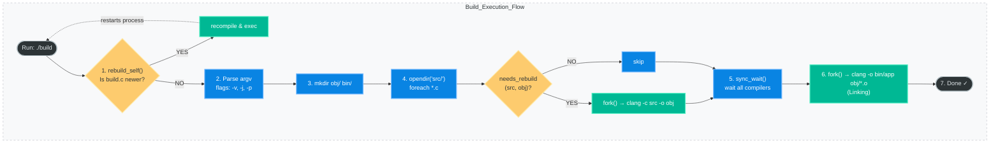

> **"Don't use Make. Use C."** — A philosophy for engineers who want full control.

As software engineers we habitually reach for **Make**, **CMake**, or **Bazel** the moment we need to compile more than one file. These are excellent tools — but they are black boxes. This article walks through building a **zero-dependency build system written entirely in C**, bootstrapping itself and compiling your project with parallel jobs, incremental rebuilds, and self-healing binaries.

This is the source system powering this very repository.

---

## Table of Contents

1. [The Philosophy — Why No Build System?](#1-the-philosophy--why-no-build-system)
2. [Project Layout](#2-project-layout)
3. [The Header: `nobuild.h`](#3-the-header-nobuildh)
   - [System Includes &amp; Configuration](#31-system-includes--configuration)
   - [Path Utilities](#32-path-utilities)
   - [Incremental Rebuild Detection](#33-incremental-rebuild-detection)
   - [Parallel Process Management](#34-parallel-process-management)
   - [The Self-Rebuild Trick](#35-the-self-rebuild-trick)
4. [The Build Driver: `build.c`](#4-the-build-driver-buildc)
   - [Bootstrapping](#41-bootstrapping)
   - [CLI Argument Parsing](#42-cli-argument-parsing)
   - [Directory Setup &amp; Clean](#43-directory-setup--clean)
   - [Parallel Compilation Loop](#44-parallel-compilation-loop)
   - [Linking Stage](#45-linking-stage)
5. [The Source Files](#5-the-source-files)
6. [How It All Fits Together](#6-how-it-all-fits-together)
7. [Running the Build System](#7-running-the-build-system)
8. [Design Deep-Dive: Key Concepts](#8-design-deep-dive-key-concepts)
9. [Extending the System](#9-extending-the-system)
10. [Comparison: Our System vs Make/CMake](#10-comparison-our-system-vs-makecmake)

---

## 1. The Philosophy — Why No Build System?

The conventional wisdom is: *"Don't reinvent the wheel."* But build tools like Make carry a 50-year-old syntax, non-obvious tab sensitivity, and a steep learning curve for anything beyond trivial projects. CMake adds another layer of abstraction on top of that.

The key insight: **C is already a systems language**. It can `fork()`, `exec()`, `stat()`, and `waitpid()`. It has everything we need to orchestrate a compiler. Why use a DSL when we can use C itself?

**Benefits of this approach:**

| Feature                       | Our C Build System | Make/CMake                      |
| ----------------------------- | ------------------ | ------------------------------- |
| Zero dependencies             | ✅                 | ❌ (requires Make/CMake binary) |
| Fully debuggable with `gdb` | ✅                 | ❌                              |
| Incremental builds            | ✅                 | ✅                              |
| Parallel compilation          | ✅                 | ✅ (`-j`)                     |
| Self-rebuilding               | ✅                 | ❌                              |
| Portable (POSIX)              | ✅                 | Varies                          |
| Readable syntax               | C                  | Makefile DSL                    |

---

## 2. Project Layout

```
how-to-build-system-in-c/
├── nobuild.h       ← The entire build system runtime (~80 lines)
├── build.c         ← Project-specific build driver
├── src/
│   ├── main.c      ← Application entry point
│   ├── hello.c     ← hello() function definition
│   └── matrix.c    ← Matrix I/O demonstration
├── obj/            ← Compiled object files (generated)
└── bin/            ← Final linked binary (generated)
```

The design is intentionally minimal. **`nobuild.h`** is the reusable engine. **`build.c`** is what you customize per project — it includes the header and describes how your specific project should be built.

---

## 3. The Header: `nobuild.h`

This is the entire runtime of our build system. It is a **single-header library** — include it, and you have everything you need.

### 3.1 System Includes & Configuration

```c
#ifndef NOBUILD_H
#define NOBUILD_H

// No Build System — A minimal C build tool for macOS
#include <stdio.h>
#include <stdlib.h>
#include <string.h>
#include <stdarg.h>
#include <dirent.h>      // Directory scanning (readdir)
#include <sys/stat.h>    // File metadata (stat, mtime)
#include <sys/wait.h>    // Process waiting (waitpid)
#include <unistd.h>      // POSIX (fork, execvp)
#include <errno.h>
#include <stdbool.h>

// --- Configuration ---
#define COMPILER "clang"
#define CFLAGS   "-Wall", "-Wextra", "-O3", "-target", "arm64-apple-macos"
```

**Why these headers?**

- `<dirent.h>` — lets us scan the `src/` directory dynamically. No hardcoded file lists.
- `<sys/stat.h>` — gives us `struct stat` with `st_mtime` for incremental builds.
- `<sys/wait.h>` + `<unistd.h>` — the POSIX process model: `fork()`, `execvp()`, `waitpid()`.

The `CFLAGS` macro expands as a comma-separated list of strings, which maps perfectly onto `char *args[] = {COMPILER, CFLAGS, ...}`.

---

### 3.2 Path Utilities

```c
void path_join(char *dest, const char *p1, const char *p2) {
    sprintf(dest, "%s/%s", p1, p2);
}
```

A minimal `path.join()` equivalent. Concatenates two path segments with a `/`. Simple, but it eliminates repetitive `sprintf` calls throughout `build.c`.

**Usage:**

```c
char src_path[256];
path_join(src_path, "src", "main.c");
// src_path == "src/main.c"
```

---

### 3.3 Incremental Rebuild Detection

This is the most important optimization in any build system: **don't recompile what hasn't changed**.

```c
bool needs_rebuild(const char *src, const char *obj) {
    struct stat stat_src, stat_obj;

    // Object file doesn't exist yet → must compile
    if (stat(obj, &stat_obj) < 0) return true;

    // Source file doesn't exist (error) → skip
    if (stat(src, &stat_src) < 0) return false;

    // Rebuild if source is newer than the object file
    return stat_src.st_mtime > stat_obj.st_mtime;
}
```

**How it works:**

The POSIX `stat()` syscall fills a `struct stat` with file metadata including `st_mtime` — the *modification time*. By comparing the modification time of the `.c` source against the `.o` object file:

- If the object doesn't exist → **rebuild** (first build).
- If the source is newer → **rebuild** (source changed).
- Otherwise → **skip** (already up to date).

This is exactly what Make does with its dependency graph, but implemented in ~8 lines of C.

---

### 3.4 Parallel Process Management

This is where things get interesting. True parallel compilation uses the Unix **fork/exec** model.

```c
typedef struct {
    pid_t pids[32]; // Tracks up to 32 parallel jobs
    size_t count;
} ProcGroup;
```

**Spawning an async compilation process:**

```c
void run_async(ProcGroup *pg, char **args) {
    pid_t pid = fork();
    if (pid == 0) {
        // Child process: replace itself with the compiler
        execvp(args[0], args);
        perror("execvp");
        exit(1);
    }
    // Parent: record the child PID and continue
    pg->pids[pg->count++] = pid;
}
```

`fork()` creates an identical copy of the current process. The child (where `pid == 0`) immediately calls `execvp()` to replace itself with the compiler binary (`clang`). The parent continues — spawning more children. This is textbook **fan-out parallelism**.

**Waiting for all jobs to finish:**

```c
void sync_wait(ProcGroup *pg) {
    for (size_t i = 0; i < pg->count; ++i) {
        int status;
        waitpid(pg->pids[i], &status, 0);
        if (!WIFEXITED(status) || WEXITSTATUS(status) != 0) {
            fprintf(stderr, "\033[31m[ERROR] Compilation failed.\033[0m\n");
            exit(1);
        }
    }
    pg->count = 0;
}
```

`waitpid()` blocks until each child exits. `WIFEXITED` and `WEXITSTATUS` extract the compiler's exit code. If any compilation fails, we abort immediately with a colored error message.

> **ANSI escape codes** like `\033[31m` (red) and `\033[0m` (reset) are used throughout for colored terminal output — a small UX touch that makes build output scannable.

---

### 3.5 The Self-Rebuild Trick

This is the most elegant feature of the entire system. When you modify `build.c`, the binary automatically detects the change and recompiles itself before proceeding:

```c
void rebuild_self(int argc, char **argv) {
    struct stat stat_src, stat_bin;
    if (stat("build.c", &stat_src) < 0) return;
    if (stat(argv[0],   &stat_bin) < 0) return;

    if (stat_src.st_mtime > stat_bin.st_mtime) {
        printf("\033[33m[REBUILD] build.c changed. Re-bootstrapping...\033[0m\n");

        // Recompile the build system itself
        char *rebuild_args[] = {COMPILER, "build.c", "-o", argv[0], NULL};
        pid_t pid = fork();
        if (pid == 0) { execvp(rebuild_args[0], rebuild_args); exit(1); }
        waitpid(pid, NULL, 0);

        // Replace the current process with the freshly-compiled binary
        execvp(argv[0], argv);
    }
}
```

The final `execvp(argv[0], argv)` is the key: it **replaces the current process** (the old binary) with the newly compiled binary — passing along the original arguments. This is a clean, zero-downtime restart. From the user's perspective, running `./build` always uses the latest version of itself.

---

## 4. The Build Driver: `build.c`

`build.c` is where project-specific logic lives. It uses `nobuild.h` as its runtime.

### 4.1 Bootstrapping

```c
#include "nobuild.h"

#define SRC_DIR "src"
#define OBJ_DIR "obj"
#define BIN_DIR "bin"

int main(int argc, char **argv) {
    rebuild_self(argc, argv); // Always check first
    ...
}
```

The very first call in `main()` is `rebuild_self()`. This ensures that if `build.c` was modified since the binary was compiled, we recompile and restart transparently.

---

### 4.2 CLI Argument Parsing

```c
bool verbose = false;
int max_jobs = 0;
const char *profile = NULL;

for (int i = 1; i < argc; ++i) {
    if (strcmp(argv[i], "-v") == 0 || strcmp(argv[i], "--verbose") == 0) {
        verbose = true;
    } else if (strcmp(argv[i], "-j") == 0 && i + 1 < argc) {
        max_jobs = atoi(argv[++i]);
    } else if (strcmp(argv[i], "-p") == 0 && i + 1 < argc) {
        profile = argv[++i];
    }
}
```

The build system supports three flags:

| Flag                   | Description                            |
| ---------------------- | -------------------------------------- |
| `-v` / `--verbose` | Enable verbose output                  |
| `-j <N>`             | Set max parallel jobs                  |
| `-p <profile>`       | Select a build profile (debug/release) |

This pattern of manually walking `argv` is idiomatic C — no `getopt` dependency needed for simple cases.

---

### 4.3 Directory Setup & Clean

```c
// Ensure output directories exist
mkdir(OBJ_DIR, 0755);
mkdir(BIN_DIR, 0755);

// Handle 'clean' subcommand
if (argc > 1 && strcmp(argv[1], "clean") == 0) {
    printf("Cleaning...\n");
    system("rm -rf obj bin");
    return 0;
}
```

`mkdir()` is idempotent — it silently succeeds if the directory already exists. The `clean` subcommand nukes the output directories. A more robust implementation would use `nftw()` to recursively delete without shelling out, but `system("rm -rf ...")` keeps the code readable for a tutorial.

---

### 4.4 Parallel Compilation Loop

```c
DIR *dir = opendir(SRC_DIR);
ProcGroup pg = {0};
char *obj_files[64];
int obj_count = 0;
struct dirent *ent;

printf("\033[32m--- Starting Build ---\033[0m\n");

while ((ent = readdir(dir)) != NULL) {
    if (strstr(ent->d_name, ".c")) {
        char src_path[256], obj_path[256], obj_name[256];
        path_join(src_path, SRC_DIR, ent->d_name);

        // Derive the object filename: hello.c → hello.o
        snprintf(obj_name, sizeof(obj_name), "%.*s.o",
                 (int)strlen(ent->d_name) - 2, ent->d_name);
        path_join(obj_path, OBJ_DIR, obj_name);

        obj_files[obj_count++] = strdup(obj_path);

        if (needs_rebuild(src_path, obj_path)) {
            printf("[CC] %s\n", src_path);
            char *args[] = {COMPILER, CFLAGS, "-c",
                            strdup(src_path), "-o", strdup(obj_path), NULL};
            run_async(&pg, args);
        } else {
            printf("[SKIP] %s is up to date\n", src_path);
        }
    }
}
closedir(dir);

sync_wait(&pg); // Wait for all parallel compilations
```

**What's happening here step by step:**

1. **`opendir()`** opens the `src/` directory for iteration.
2. **`readdir()`** returns each entry (`struct dirent`) one at a time.
3. **`strstr(ent->d_name, ".c")`** filters for C source files.
4. **`snprintf` with `%.*s`** trims the `.c` extension to form the `.o` name. `%.*s` takes a precision from an `int` argument — here `strlen - 2` cuts off the last 2 characters (`.c`).
5. **`needs_rebuild()`** checks `mtime`. If true, we call **`run_async()`** to fork a compiler process.
6. **`strdup()`** is required because `args[]` is stack-allocated and will be gone after the `while` body — the child process needs stable memory.
7. After the loop, **`sync_wait()`** blocks until every compiler process exits, then validates exit codes.

---

### 4.5 Linking Stage

```c
printf("[LINK] Generating %s/app\n", BIN_DIR);
char *link_args[128] = {COMPILER, "-o", BIN_DIR"/app"};

for (int i = 0; i < obj_count; i++)
    link_args[i + 3] = obj_files[i];
link_args[obj_count + 3] = NULL;

pid_t pid = fork();
if (pid == 0) { execvp(link_args[0], link_args); exit(1); }
waitpid(pid, NULL, 0);

printf("\033[32m--- Build Finished Successfully ---\033[0m\n");
```

Linking is a single synchronous process — we fork once, exec the linker (here the compiler frontend acts as linker), and `waitpid()` synchronously. The `link_args` array is dynamically assembled by iterating over the collected object file paths.

---

## 5. The Source Files

These are the application files being compiled by the build system.

### `src/main.c` — Entry Point

```c
#include <stdio.h>
void hello(); // Forward declaration

int main() {
    hello();
    return 0;
}
```

Intentionally minimal. `main()` calls `hello()`, declared via a forward declaration. The linker resolves the actual definition from `hello.o`.

### `src/hello.c` — The Hello Function

```c
#include <stdio.h>

void hello() {
    printf("Hello M4 World!\n");
}
```

The implementation of `hello()`. Compiled separately into `obj/hello.o` and linked with `obj/main.o`.

### `src/matrix.c` — Matrix I/O Demo

```c
#include <stdio.h>

int main() {
    int m = 3, n = 3;
    int A[m][n];

    for (int i = 1; i <= m; i++) {
        for (int j = 1; i <= n; j++) {
            scanf("%d \t", &A[i][j]);
            printf("%d \t", A[i][j]);
        }
        printf("\n");
    }
    return 0;
}
```

A matrix I/O exercise demonstrating VLA (Variable Length Arrays) in C99. Note: this currently has a bug — the inner loop condition uses `i <= n` instead of `j <= n`. Spotting and fixing bugs like this is part of the learning process.

---

## 6. How It All Fits Together



---

## 7. Running the Build System

### Step 1: Bootstrap (one time only)

The build system binary does not exist yet, so we compile it manually once:

```bash
clang -o build build.c
```

This produces the `build` executable. From here on, it manages itself.

### Step 2: Run the Build

```bash
./build
```

**Expected output:**

```
--- Starting Build ---
[CC] src/hello.c
[CC] src/main.c
[CC] src/matrix.c
[LINK] Generating bin/app
--- Build Finished Successfully ---
```

On subsequent runs (no changes):

```
--- Starting Build ---
[SKIP] src/hello.c is up to date
[SKIP] src/main.c is up to date
[SKIP] src/matrix.c is up to date
[LINK] Generating bin/app
--- Build Finished Successfully ---
```

### Step 3: Verify the Output

```bash
./bin/app
# Result: Hello M4 World!
```

### Step 4: Test Self-Rebuild

Modify `build.c` (add a comment, change a `printf`, anything). Then run:

```bash
./build
```

**Expected output:**

```
[REBUILD] build.c changed. Re-bootstrapping...
--- Starting Build ---
...
```

The binary re-compiled itself and restarted transparently.

### Step 5: Clean

```bash
./build clean
```

Removes `obj/` and `bin/` directories entirely.

---

## 8. Design Deep-Dive: Key Concepts

### The Fork/Exec Model

Every process spawned by this system uses the classic POSIX fork/exec pattern:

```
Parent Process (./build)
    │
    ├── fork() ──→ Child 1 (clang -c src/hello.c -o obj/hello.o)
    ├── fork() ──→ Child 2 (clang -c src/main.c  -o obj/main.o)
    ├── fork() ──→ Child 3 (clang -c src/matrix.c -o obj/matrix.o)
    │
    └── sync_wait() ──→ waits for Child 1, 2, 3 to finish
```

`fork()` duplicates the process (cheap on modern kernels with copy-on-write pages). `execvp()` replaces the child's image with the compiler. The parent never blocks — it keeps spawning. `waitpid()` harvests them at the end.

### `execvp` vs `system`

We use `execvp()` instead of `system()` deliberately:

| `system("clang ...")`         | `execvp(args[0], args)` |
| ------------------------------- | ------------------------- |
| Spawns a shell (`/bin/sh -c`) | Directly execs the binary |
| Shell injection possible        | No shell involved         |
| One extra process               | Zero overhead             |
| String building required        | Array of args             |

`execvp` takes a `char **argv`-style array — exactly what `main()` receives — making it natural to build programmatically.

### Mtime-Based Incremental Builds

`st_mtime` is a Unix timestamp (seconds since epoch) stored in every file's inode. It is updated whenever a file is written. This gives us sub-second (on Linux, nanosecond with `st_mtimespec`) granularity for change detection.

Limitation: modifying a header file does not automatically trigger recompilation of all `.c` files that include it (because we only track `.c` → `.o` relationships). A production system would parse `#include` chains — exactly what Make's `-MMD` flags do by generating `.d` dependency files.

---

## 9. Extending the System

### Add Header Dependency Tracking

Generate `.d` files by adding `-MMD -MF obj/file.d` to `CFLAGS`, then parse them before deciding whether to rebuild:

```c
// After compilation:
// obj/hello.d contains: obj/hello.o: src/hello.c include/util.h
// Parse this file and stat() each dependency
```

### Add Build Profiles

The `-p` flag is already parsed. Wire it up:

```c
const char *extra_flags = "";
if (profile && strcmp(profile, "debug") == 0)
    extra_flags = "-g -O0 -DDEBUG";
else if (profile && strcmp(profile, "release") == 0)
    extra_flags = "-O3 -DNDEBUG";
```

### Add Colored Compilation Errors

Pipe `clang`'s stderr through a filter or use `-fcolor-diagnostics`:

```c
#define CFLAGS "-Wall", "-Wextra", "-O3", "-fcolor-diagnostics", \
               "-target", "arm64-apple-macos"
```

### Cross-Platform Support

Swap `fork/exec` for `CreateProcess` on Windows, and `dirent` for `FindFirstFile/FindNextFile`. The header abstracts these behind the same interface.

---

## 10. Comparison: Our System vs Make/CMake

```
Feature                  | nobuild.h | Makefile | CMakeLists.txt
─────────────────────────┼───────────┼──────────┼───────────────
Bootstrap requirement    | clang     | make     | cmake + make
Lines of build code      | ~170      | ~20      | ~30
Language                 | C         | DSL      | DSL
Debuggable               | gdb/lldb  | No       | No
Self-rebuilding          | ✅        | ❌       | ❌
Incremental builds       | ✅        | ✅       | ✅
Parallel jobs            | ✅        | -j flag  | ✅
Header dep tracking      | Manual    | -MMD     | Automatic
Cross-platform           | POSIX     | POSIX    | All platforms
Custom logic (loops, if) | Full C    | Awkward  | CMake DSL
```

The tradeoff is clear: our system is more verbose but **entirely transparent**. There is no magic — every behavior is readable C code you can step through in a debugger.

---

## Contributing

This project is intentionally kept minimal and educational. If you find improvements or extensions that don't add external dependencies, pull requests are welcome.

```bash
git clone https://github.com/ajeetkbhardwaj/how-to-build-system-in-c
cd how-to-build-system-in-c
clang -o build build.c
./build
./bin/app
```

---

## MIT License

This project is released into the public domain. Use it, study it, hack it.

---

### Citation

```bibtex
@software{latex-template,
  title={How to Build a Build System in C},
  author={Ajeet Kumar},
  profile={https://ajeetkbhardwaj.github.io},
  year={2026},
  url={https://github.com/ajeetkbhardwaj/how-to-build-system-in-c},
  license={MIT},
}

```
