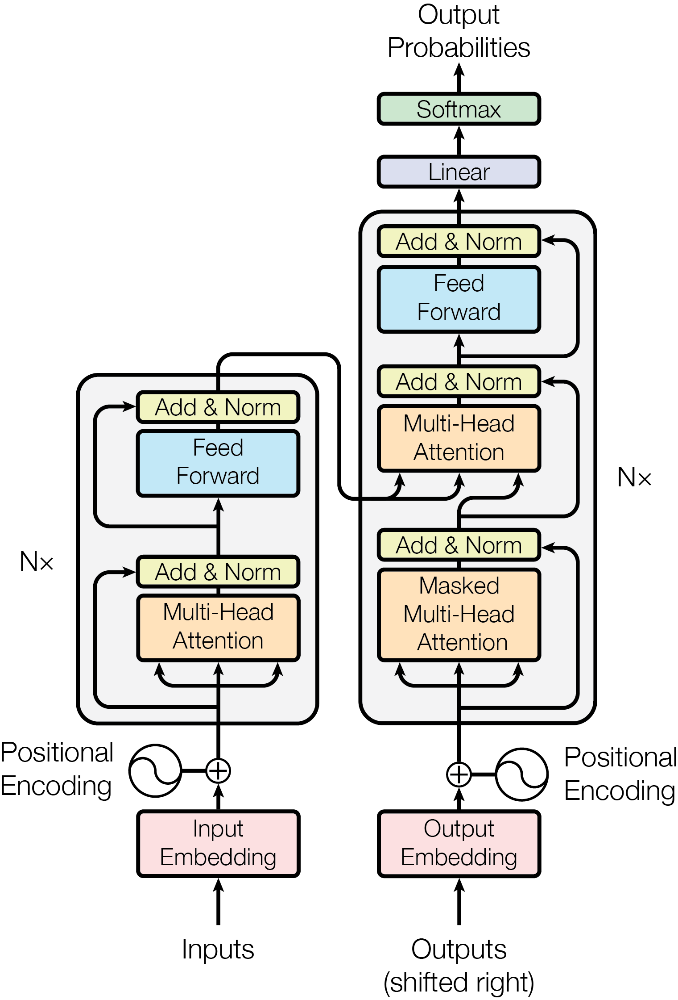
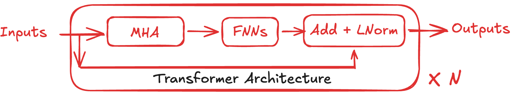
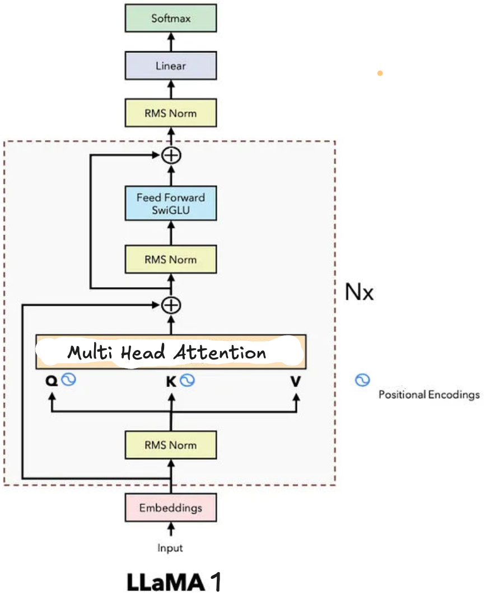
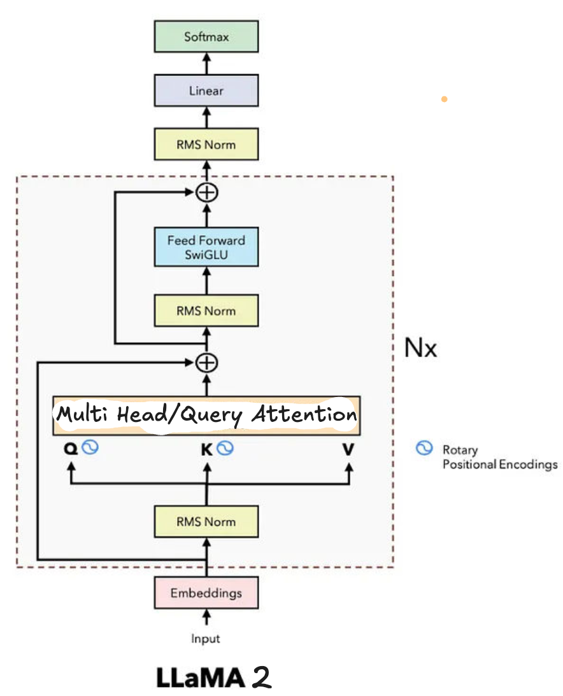
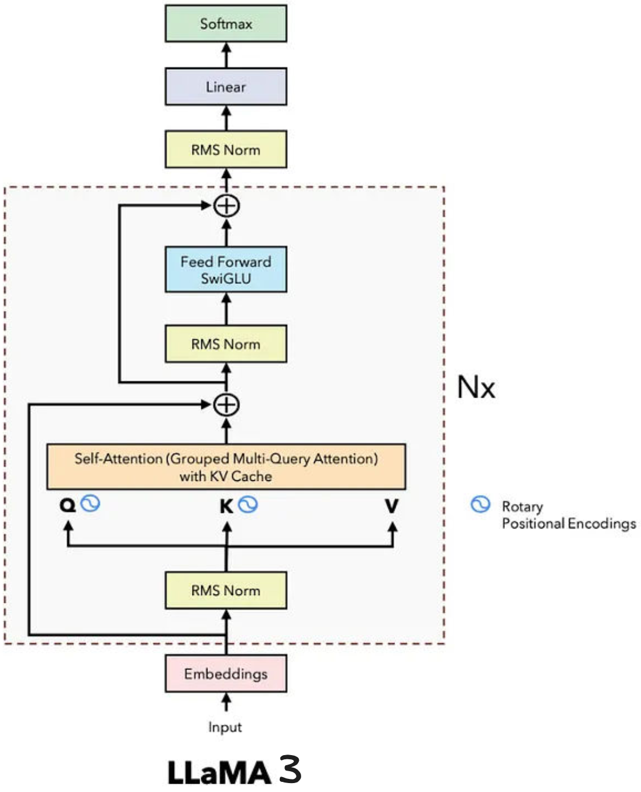
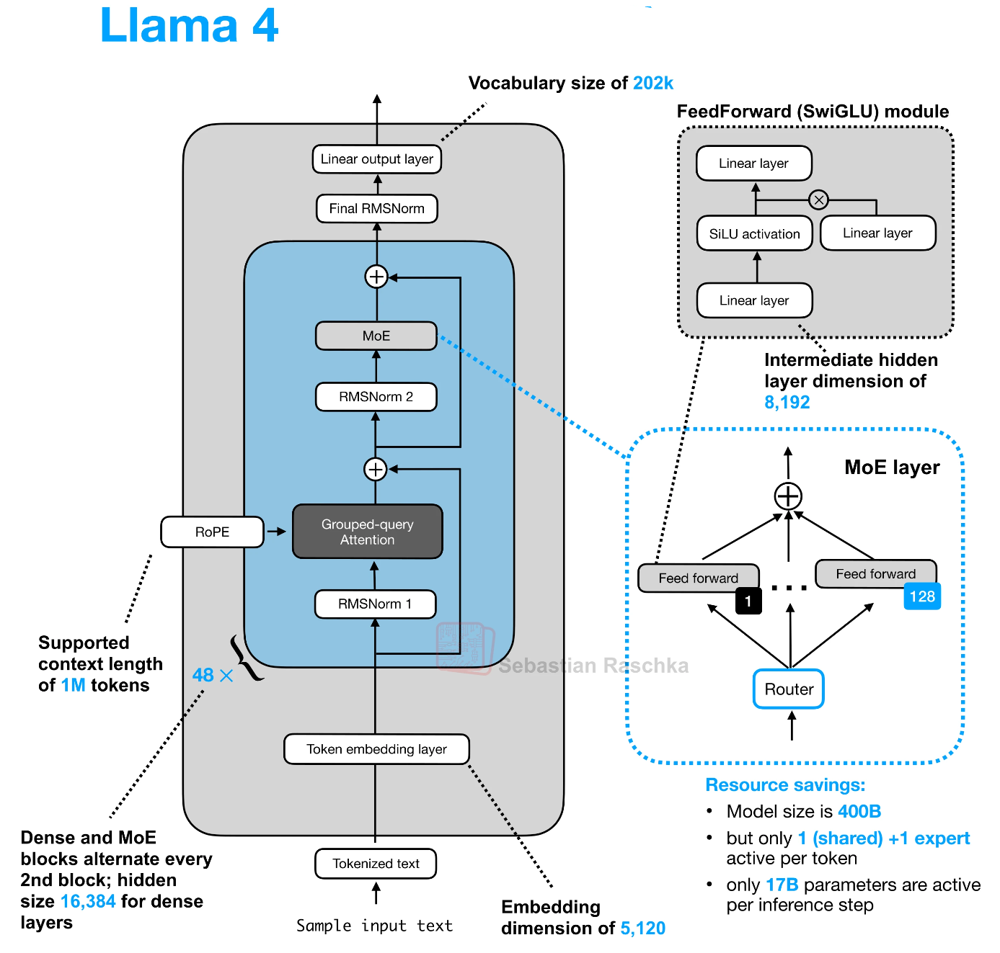

# A Study of Llama Lineage : A Transformer based LLMs

We know that most of LLM are based onto the transformer architecture. So, i will explore the llama series.

The Llama series from Meta AI ignited the open-weights revolution, democratizing frontier-level AI by releasing research-grade models under permissive open source license since the first Llama 1's surprise drop in February 2023. Progressing from 7B-65B dense decoder-only Transformers trained on 1-2T tokens, the lineage evolved through efficiency innovations (RoPE, GQA), massive scaling (405B params on 15T+ tokens), native multimodality (Llama 3.2), and finally sparse **Mixture-of-Experts (MoE)** architectures in Llama 4—reaching ~2T total parameters with 10M-token contexts and vision-language fusion. This trajectory mirrors industry shifts from text-only pretraining to agentic, multimodal systems deployable on edge devices, forcing competitors (Mistral, DeepSeek) to match openness while Meta dictates architectural norms via reproducible scaling laws.[^7]

## Foundation - Establishes Baseline

### Transformer Era: Proprietary Lockdown (2017-2022)


The main workflow you needed to understand is this one 



The **original Transformer** ("Attention is All You Need," Vaswani et al., NeurIPS 2017) revolutionized sequence modeling by replacing recurrent bottlenecks with  **parallelizable self-attention** to over come the limitation of recurrent based architecture.

| RNN Weakness        | Transformer Strength  | Promises                  |
| ------------------- | --------------------- | ------------------------- |
| Sequential          | Parallel              | 10-100x training speedup  |
| Vanishing gradients | Direct paths          | Long-range dependencies   |
| Fixed hidden state  | Dynamic attention     | Global context awareness  |
| Hard to scale       | Highly parallelizable | GPT-scale models possible |

The main equation present in the transformer paper was how to calculate the attention ? i think therefore paper named as attention all you need.

$$
Attention(Q,K,V) = softmax(\frac{QK^T}{\sqrt{d_k}}) V
$$

| **Transformer Component** | **Era 1: The Foundation (2017 - 2020)** | **Era 2: The Scaling Law (2021 - 2023)** | **Era 3: Efficiency & MoE (2024 - Present)** | **Era 4: The Next Frontier (Current Research/Future)** |
| ------------------------------- | --------------------------------------------- | ---------------------------------------------- | -------------------------------------------------- | ------------------------------------------------------------ |
| **Base Architecture**     | Standard Dense Transformer                    | Deep Dense Transformer                         | Sparse Mixture-of-Experts (MoE)                    | State Space Models (SSMs), Hybrid MoE-SSMs                   |
| **Attention Mechanism**   | Multi-Head Attention (MHA)                    | MHA & Multi-Query Attention (MQA)              | Grouped-Query Attention (GQA), Sliding Window      | Linear Attention, FlashAttention-3, Infini-attention         |
| **Positional Encoding**   | Absolute Sinusoidal                           | Learned Absolute                               | Rotary Positional Embeddings (RoPE)                | LongRoPE, Dynamic YaRN (Infinite scaling)                    |
| **Activation Function**   | ReLU / GELU                                   | GELU / Swish                                   | SwiGLU (Gated Linear Units)                        | DeepSeek-style specialized gated activations                 |
| **Normalization**         | LayerNorm (Post-Norm)                         | LayerNorm (Pre-Norm)                           | RMSNorm (Pre-Norm)                                 | RMSNorm variants (DeepNorm for 1000+ layers)                 |
| **KV Caching Limit**      | 512 tokens                                    | 2K - 8K tokens                                 | 128K - 1M tokens (via GQA)                         | 10M+ tokens (via Ring Attention / Cross-Node KV)             |
| **Compute Scaling**       | Parameter count = Active Compute              | Parameter count = Active Compute               | Compute Decoupled from Capacity (Routing)          | Continuous Routing, Micro-Experts (e.g., 256+ experts)       |
| **Representative Models** | Original Transformer, BERT                    | GPT-3, Llama-1, LLaMA-2, Chinchilla            | GPT-4, Mixtral, Llama 3, DeepSeek V3               | Mamba-2, Jamba, Llama 4 (Upcoming)                           |

### Llama 1 (7B-65B, Feb 2023)

Before Llama 1's February 2023 debut, the industry was locked in a  **proprietary Transformer era** . The original Transformer (Vaswani et al., 2017) introduced parallelizable self-attention, obliterating RNN/LSTM sequential bottlenecks, but open research stalled post-BERT, GPT-2. By 2022,  **closed giants dominated** :

* **GPT-3 (175B, OpenAI)** : Commercial API-only, no weights released
* **PaLM (540B, Google)** : Research paper, internal deployment
* **OPT (175B, Meta)** : Open weights, but inferior training (180B CommonCrawl tokens vs. curated mixes)

 **Industry Context** : No open model approached GPT-3 quality. Transformers were commoditized (Hugging Face), but scaling remained proprietary black magic.



It crystallized optimal dense Transformer choices **RMSNorm** pre-norm (faster training convergence vs. LayerNorm), **SwiGLU** activations (2x expressivity over ReLU via $\text{SwiGLU}(x) = x \cdot \sigma(W_1 x) \odot W_2 x$), and **Rotary Positional Embeddings (RoPE)** encoding relative positions via rotation matrices on query-key vectors—enabling extrapolation to 2K→4K contexts without retraining. Trained on 1T high-quality tokens (no web scrapes), Llama-13B matched GPT-3 175B on benchmarks despite 13x fewer params, proving quality-over-quantity data curation.

### Llama 2.x


It introduced **Grouped-Query Attention (GQA)**: grouping query heads (e.g., 8:1 Q:K ratio) to share KV heads, slashing KV-cache memory 4-8x for 4K contexts while retaining 99% MHA quality. This solved inference bottlenecks—standard MHA's $O(n^2 d)$ VRAM explosion—paving dense scaling. Both used 32-layer stacks, 4096 hidden dim, enabling local runs on consumer GPUs.[^1]

### Llama 3.x



#### Llama 3 : Scaling Law to Push Dense Limits

It exploded to **128K context** via RoPE therapeutic tuning (reembedding longer sequences) and **128K vocab** (TikToken-trained on 15T tokens: 50% code/math, 30% multilingual). Architectural refinements: 80 layers (70B), interleaved RMSNorm/SwiGLU, 128 heads (GQA 8:1), yielding MMLU 82%+—closing proprietary gaps.

#### Llama 3.1 : Scaling Law to Push Dense Limits

**Llama 3.1** (Jul 2024) peaked dense era at **405B params** (15.4T tokens, synthetic data distillation), with key engineering: **weight-tied tied-embeddings** (vocab=hidden dim), **post-norm FFNs** for stability, and **15T token mix** (60% post-2020 data). Training on 16K H100s took 3.8M GPU-hours; inference needed 8x 80GB GPUs. This "frontier open model" beat GPT-4o on coding/math, validating dense scaling limits.[^5]

#### Llama 3.2 : Multimodality and Edge Computing

**Llama 3.2** (Sep 2024) introduced **native vision** via early-fusion: CLIP-ViT-L/14 encoder projects 224x224 images to tokens, interleaved with text in 128K decoder. Architecture split: **1B/3B "lightweight"** (11-layer, 4K context) for edge (iPhone/Android), **11B/90B vision models** (GQA-tuned, 128K ctx) for reasoning (chart/math understanding). Perceiver Resampler compressed vision tokens 24x.

#### Llama 3.3 : Multimodality and Edge Computing

**Llama 3.3** (late 2024) added **multilingual instruction tuning** (200+ langs, 10x Llama 3 tokens) atop 128K vision-text stack, with **speculative decoding** hooks for 2x edge throughput. This dual-track—tiny edge + massive cloud—enabled on-device agents while scaling reasoning.[^5]

### Llama 4.x

#### Llama 4 : Mixture of Expert



**Llama 4** (Apr 2025) pivots to **sparse MoE**, Meta's first: convert alternate FFNs to expert layers (16-320 experts), activating 17B params/token from 109B-2T total. Flagship **Behemoth** (~2T total, **288B active**, ~320 experts, top-2 routing) pretrained on 40T+ tokens, supports **10M context** via **long-RoPE** + sliding GQA.

- **Scout**: 17B active (total ~272B, 16 experts)—edge MoE, 10M ctx, multimodal.
- **Maverick**: 17B active (total ~2.2T, **128 experts**)—balanced server/edge.

**Distillation**: Scout/Maverick fine-tuned from Behemoth via progressive expert capacity reduction + MetaP hyperparam transfer (layer-wise LR/init scales). Native vision (ViT-L/3B) fuses at token level; hybrid dense-MoE layers stabilize routing. Trained on 32K H100s, they match GPT-4.5/Grok-3 at 10-20% compute.[^10][^1]

## Architectural Bottlenecks and Optimization

**Serving 2T MoE**: All experts must reside in VRAM (Behemoth: ~4TB FP8 across 64x H100s)—no activation sparsity savings at load. **All-to-all comm** shuffles tokens across GPUs (500GB/s bandwidth); stragglers kill throughput.

**10M KV Cache**: GQA (16:1 ratio) + **PagedAttention** (vLLM-style blocks) + 4-bit quantization caps at ~1TB VRAM/batch. Prefill O(n²) needs **FlashAttention-3** tiling; edge Scout uses **expert offloading** to NVMe.

Optimizations: **capacity scheduling** (1.25x token cap/expert), noisy top-2 routers, **aux-loss balancing** ($L_{bal} = 0.01 \cdot N \sum f_i \log f_i$). Deployment: DeepSpeed-MoE for multi-node, TensorRT-LLM for inference.[^1]

## Advanced Topics and Research Directions

- **MoE Limits**: Routing overhead (5-10% latency), expert collapse at 1000+ experts.
- **Infinite Context**: Hybrid SSM-MoE (RWKV layers), continuous routing (softmax vs. top-k).
- **Agentic Open AI**: Llama 4 + tool-calling natives; self-improving via synthetic data loops.

**Questions**: Optimal expert granularity (micro-experts)? MoE quantization fragility? Unified dense-sparse training ?

## Conclusion

Meta's Llama evolution—from RoPE/GQA dense baselines to 2T MoE multimodal giants—has scripted AI's open frontier, forcing proprietary labs to open weights while validating scaling laws at 10M contexts. Llama 4's sparse shift dictates 2026+ architectures; emulate its distillation + balancing for your MoE experiments—open weights now shape the agentic era.[^4][^1]

Citation Information

```

```

## Reference

[^1]: https://cameronrwolfe.substack.com/p/llama-4
    
[^2]: https://local-ai-zone.github.io/brands/llama-ai-open-source-complete-guide-2025.html
    
[^3]: https://blog.risingstack.com/llama-4-overview/
    
[^4]: https://ai.meta.com/blog/llama-4-multimodal-intelligence/
    
[^5]: https://ai.meta.com/blog/future-of-ai-built-with-llama/
    
[^6]: https://www.linkedin.com/pulse/llama-4-mixture-experts-enabling-efficiency-scalability-mina-zaki-eb0uf
    
[^7]: https://arxiv.org/html/2510.12178v1
    
[^8]: https://techcrunch.com/2025/10/06/meta-llama-everything-you-need-to-know-about-the-open-generative-ai-model/
    
[^9]: https://www.dailydoseofds.com/building-llama-4-from-scratch-with-python/
    
[^10]: https://www.gocodeo.com/post/llama-4-models-architecture-benchmarks-more

[^11]: https://arxiv.org/html/1706.03762v7


